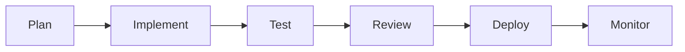

# Feature Development Workflow

## Description

Complete feature development lifecycle from planning to deployment.

## Workflow Steps



## Usage

```bash
# Create complete feature workflow
agentflow create "Feature: User Auth" -d "
  workflow: feature-development
  feature: User authentication with JWT
  tasks:
    - plan: Design auth architecture
    - implement: Build auth API and UI
    - test: Unit and integration tests
    - review: Security and code review
    - deploy: Deploy to staging
"
```

## Step Details

### 1. Planning
```bash
agentflow create "Plan auth system" -d "
  Analyze requirements:
  - Authentication methods (JWT, OAuth)
  - User model and database schema
  - API endpoints design
  - Security considerations
"
```

### 2. Implementation
```bash
# Parallel implementation
agentflow create "Implement backend" -d "Build auth API"
agentflow create "Implement frontend" -d "Build login UI"
# Both execute concurrently with Git locks
```

### 3. Testing
```bash
agentflow create "Test auth" -d "
  - Unit tests: npm run test:unit
  - Integration tests: npm run test:integration
  - E2E tests: npm run test:e2e
  - Security audit: npm audit
"
```

### 4. Review
```bash
agentflow create "Review auth" -d "
  - Code quality check
  - Security vulnerability scan
  - Performance analysis
  - Documentation review
"
```

### 5. Deployment
```bash
agentflow create "Deploy auth" -d "
  - Deploy to staging: ./deploy.sh staging
  - Smoke tests: ./smoke-tests.sh
  - Deploy to production: ./deploy.sh prod
"
```

## Checkpoints

Each step automatically saves checkpoints:

```typescript
// After implementation
saveCheckpoint('implementation_complete', {
  files: ['auth.ts', 'auth.test.ts', 'login.tsx'],
  tests_passed: 15,
  coverage: '92%'
});

// Resume from checkpoint if failure occurs
// → No need to redo completed steps
```

## Task Dependencies

Tasks are automatically ordered using DAG:

```
Plan → Implement → Test → Review → Deploy
        ↓         ↓       ↓       ↓
      [Git locks prevent conflicts]
```
