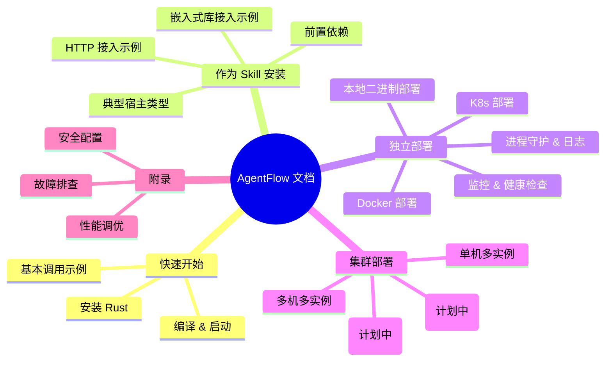

# AgentFlow - AI Agent Task Collaboration System

[](LICENSE)
[](https://www.rust-lang.org/)
[](https://github.com/MoSiYuan/AgentFlow)
[](https://github.com/MoSiYuan/AgentFlow/releases)
[](https://github.com/MoSiYuan/AgentFlow/actions)

**纯 Rust 实现的单进程高性能 AI Agent 任务编排系统**

## 🎯 版本 3.0（纯 Rust 重写）

AgentFlow v3 是完全用 Rust 重写的版本，采用革命性的**单进程架构**，Master 服务器同时充当 Worker，无需独立的工作进程。

### 核心特性

- ✅ **单一二进制** - 一个可执行文件，无外部依赖
- ✅ **单进程架构** - Master = Worker，无需进程间通信
- ✅ **高性能** - 基于 Tokio 异步运行时，内存占用 < 100MB
- ✅ **直接执行** - 通过 tokio::process 直接调用 Claude CLI
- ✅ **向量记忆** - 基于 SQLite 的向量索引和语义检索
- ✅ **沙箱安全** - 完整的路径验证和进程隔离
- ✅ **REST API** - 提供 14 个 HTTP 端点
- ✅ **实时通信** - WebSocket 和 SSE 流式传输支持

## 📚 文档导航

### 快速索引

**快速试用**：
- [部署指南](DEPLOYMENT_GUIDE.md) - 快速安装和配置
- [Rust v3 快速开始](RUST_V3_QUICKSTART.md) - 本地开发试用

**集成与部署**：
- [技能集成指南](docs/SKILL_INTEGRATION.md) - 作为 skill 集成到其他系统
- [生产部署指南](docs/DEPLOYMENT.md) - 生产环境部署（systemd/Docker/K8s）
- [集群部署指南](docs/CLUSTERING.md) - 多节点集群部署方案

**深入理解**：
- [系统架构](docs/ARCHITECTURE.md) - 架构设计和组件说明
- [功能特性](docs/FEATURES.md) - 完整功能列表
- [认证系统](AUTH_GUIDE.md) - 双认证系统使用指南

**用户指南**：
- [Agent 使用指南](docs/AGENT_USAGE_GUIDE.md) - 分场景使用说明
- [版本路线图](docs/VERSION_ROADMAP.md) - 版本规划

### 📖 Documentation Structure



---

## 🚀 快速开始

### 方式 1：一键安装（推荐）

#### Linux/macOS

```bash
curl -fsSL https://raw.githubusercontent.com/MoSiYuan/AgentFlow/main/scripts/install.sh | bash
```

Or download and run manually:

```bash
wget https://raw.githubusercontent.com/MoSiYuan/AgentFlow/main/scripts/install.sh
chmod +x install.sh
./install.sh
```

#### Windows

```powershell
irm https://raw.githubusercontent.com/MoSiYuan/AgentFlow/main/scripts/install.ps1 | iex
```

### 方式 2：从源码构建

#### 1. 安装 Rust

```bash
curl --proto '=https' --tlsv1.2 -sSf https://sh.rustup.rs | sh
source "$HOME/.cargo/env"
```

#### 2. 编译 AgentFlow

```bash
cd rust
export SQLX_OFFLINE=true
cargo build --release
```

#### 3. 运行 AgentFlow

```bash
./target/release/agentflow-master
```

服务将启动在 `http://localhost:6767`

## 📝 使用示例

### 运行模式

AgentFlow 支持三种运行模式：

#### 1. 本地模式（默认）

使用 Claude CLI 在本地执行任务：

```bash
agentflow server local
# 或简单地
agentflow server
```

#### 2. 云端模式（支持 Webhooks）

与 AI 平台（如智谱 AI）集成：

```bash
agentflow server cloud
```

#### 3. 仅规划模式

规划和验证任务但不执行：

```bash
agentflow server planner-only
```

### 创建任务

```bash
curl -X POST http://localhost:6767/api/v1/tasks \
  -H "Content-Type: application/json" \
  -d '{
    "title": "Test Task",
    "description": "echo Hello from AgentFlow v3!",
    "priority": "high"
  }'
```

### 执行任务（带 SSE 流式传输）

```bash
curl -X POST http://localhost:6767/api/v1/tasks/1/execute \
  -H "Accept: text/event-stream"
```

### 查询任务状态

```bash
curl http://localhost:6767/api/v1/tasks/1
```

## 🔌 REST API 端点

AgentFlow 提供 14 个 HTTP 端点用于任务管理和系统控制。

### 认证

所有 API 请求需要 Bearer Token 认证：

```bash
# 使用 Session Token
curl http://localhost:6767/api/v1/tasks \
  -H "Authorization: Bearer <session_token>"

# 使用 API Key
curl http://localhost:6767/api/v1/tasks \
  -H "Authorization: Bearer sk_<timestamp>_<signature>"
```

### 任务管理

| 方法 | 端点 | 描述 | 认证 |
|------|------|------|------|
| POST | `/api/v1/tasks` | 创建新任务 | Bearer |
| GET | `/api/v1/tasks` | 获取任务列表 | Bearer |
| GET | `/api/v1/tasks/:id` | 获取任务详情 | Bearer |
| POST | `/api/v1/tasks/:id/execute` | 执行任务 | Bearer |
| DELETE | `/api/v1/tasks/:id` | 取消任务 | Bearer |
| PATCH | `/api/v1/tasks/:id/priority` | 更新任务优先级 | Bearer |

### 集群管理

| 方法 | 端点 | 描述 | 认证 |
|------|------|------|------|
| GET | `/api/v1/cluster/leader` | 查看当前 Leader | Bearer |
| GET | `/api/v1/cluster/nodes` | 查看所有节点 | Bearer |
| GET | `/api/v1/cluster/status` | 查看集群状态 | Bearer |

### 工作流管理

| 方法 | 端点 | 描述 | 认证 |
|------|------|------|------|
| POST | `/api/v1/workflows` | 创建工作流 | Bearer |
| GET | `/api/v1/workflows/:name` | 获取工作流详情 | Bearer |
| POST | `/api/v1/workflows/:name/execute` | 执行工作流 | Bearer |

### 系统管理

| 方法 | 端点 | 描述 | 认证 |
|------|------|------|------|
| GET | `/health` | 健康检查 | 无需认证 |
| GET | `/api/v1/stats` | 系统统计信息 | Bearer |
| POST | `/api/v1/login` | 用户登录获取 Session | 无需认证 |

### 实时通信

| 类型 | 端点 | 描述 |
|------|------|------|
| WebSocket | `/ws/task` | 任务执行实时流 |
| SSE | `/api/v1/stream` | 服务器发送事件流 |

详细的 API 文档请参考：[API 文档](docs/API_REFERENCE.md)

## 🌐 云端模式与智谱 AI 集成

AgentFlow 可以与智谱清言（Zhipu AI）集成，构建 AI 驱动的任务编排系统。

### 快速配置

1. **配置智谱 AI 集成**

Edit `~/.agentflow/config.toml`:

```toml
[server]
port = 6767

[webhook]
enabled = true
secret = "your-webhook-secret-key"

[zhipu]
enabled = true
api_key = "your-zhipu-api-key"
model = "glm-4"
```

2. **Start AgentFlow in Cloud Mode**

```bash
agentflow server cloud
```

3. **Setup Public URL** (for testing)

```bash
# Using ngrok
ngrok http 6767
# Output: https://abc123.ngrok.io
```

4. **Configure Zhipu AI Webhook**

In Zhipu AI Console, set webhook URL to:
```
https://abc123.ngrok.io/api/v1/webhook
```

5. **Test Integration**

Send a message through Zhipu AI:
```
"帮我创建一个任务，分析这个项目的代码结构"
```

AgentFlow will receive the webhook, create a task, execute it, and send the result back to Zhipu AI.

### Example Webhook Request

```json
{
  "event": "message.received",
  "timestamp": "2026-01-28T10:30:00Z",
  "data": {
    "message_id": "msg_123",
    "user_id": "user_abc",
    "content": "帮我分析这个Go项目的代码结构",
    "metadata": {
      "source": "zhipu",
      "model": "glm-4"
    }
  }
}
```

### Detailed Documentation

- **[ZHIPU_INTEGRATION.md](docs/ZHIPU_INTEGRATION.md)**: Complete Zhipu AI integration guide
- **[CONFIGURATION.md](docs/CONFIGURATION.md)**: Full configuration reference

---

## ⚡ Distributed Execution Mode (NEW!)

AgentFlow now supports **distributed parallel execution** with Master cluster, workflow orchestration, and intelligent scheduling! (v0.4.0)

### Key Features

- ✅ **Master Cluster** - Raft-based leader election and fault tolerance
- ✅ **DAG Workflows** - Task dependency management and parallel execution
- ✅ **Priority Queue** - Intelligent task scheduling (Urgent > High > Medium > Low)
- ✅ **Worker Registry** - Health checking and load balancing
- ✅ **Agent Communication** - Point-to-point and broadcast messaging
- ✅ **Distributed Locks** - Cross-node coordination

### Quick Start

#### 1. Start Master Cluster (3 nodes)

```bash
# Terminal 1 - Master 1
cargo run --bin agentflow-master -- \
  --node-id master-1 --port 6767 \
  --peers master-1:6767,master-2:6768,master-3:6769

# Terminal 2 - Master 2
cargo run --bin agentflow-master -- \
  --node-id master-2 --port 6768 \
  --peers master-1:6767,master-2:6768,master-3:6769

# Terminal 3 - Master 3
cargo run --bin agentflow-master -- \
  --node-id master-3 --port 6769 \
  --peers master-1:6767,master-2:6768,master-3:6769
```

#### 2. Create Workflow

```bash
curl -X POST http://localhost:6767/api/v1/workflows \
  -H "Content-Type: application/json" \
  -d '{
    "name": "ci-pipeline",
    "tasks": [
      {"id": "build", "dependencies": []},
      {"id": "test", "dependencies": ["build"]},
      {"id": "deploy", "dependencies": ["test"]}
    ]
  }'
```

#### 3. Check Cluster Status

```bash
# View current leader
curl http://localhost:6767/api/v1/cluster/leader

# View all nodes
curl http://localhost:6767/api/v1/cluster/nodes

# View workflow execution
curl http://localhost:6767/api/v1/workflows/ci-pipeline
```

### Verification

```bash
cd rust
./verify-distributed-build.sh
```

### Documentation

- **[Distributed Execution System](docs/DISTRIBUTED_EXECUTION_SYSTEM.md)** - Complete system architecture and API reference
- **[Quick Start Guide](docs/DISTRIBUTED_QUICK_START.md)** - 5-minute setup guide
- **[Implementation Status](docs/DISTRIBUTED_EXECUTION_STATUS.md)** - Technical details and progress
- **[README](rust/README_DISTRIBUTED.md)** - Feature overview and examples

---

## 🏗️ Architecture

```
┌─────────────────────────────────────────────┐
│   agentflow-master (单一二进制)             │
│                                             │
│  ┌───────────────────────────────────────┐ │
│  │  HTTP/WebSocket API (Axum)            │ │
│  └───────────┬───────────────────────────┘ │
│              ↓                              │
│  ┌───────────────────────────────────────┐ │
│  │  Task Scheduler                       │ │
│  └───────────┬───────────────────────────┘ │
│              ↓                              │
│  ┌───────────────────────────────────────┐ │
│  │  TaskExecutor (tokio::process)       │ │
│  │  - Execute Claude CLI                  │ │
│  │  - ProcessKiller (timeout)            │ │
│  │  - PromptBuilder                       │ │
│  └───────────┬───────────────────────────┘ │
│              ↓                              │
│  ┌───────────────────────────────────────┐ │
│  │  MemoryCore (SQLite)                  │ │
│  │  - Vector indexing                    │ │
│  │  - Semantic search                    │ │
│  └───────────┬───────────────────────────┘ │
│              ↓                              │
│  ┌───────────────────────────────────────┐ │
│  │  Sandbox (Security)                   │ │
│  │  - Path whitelist                     │ │
│  │  - Symlink protection                 │ │
│  └───────────────────────────────────────┘ │
└─────────────────────────────────────────────┘
              ↓
    ┌──────────────────┐
    │  claude CLI      │
    └──────────────────┘
```

## 📦 Project Structure

```
rust/
├── agentflow-core/          # Core library
│   ├── src/
│   │   ├── types.rs        # Shared types
│   │   ├── executor/       # Task execution engine
│   │   ├── memory/         # Memory system
│   │   └── sandbox/        # Security sandbox
│   └── Cargo.toml
│
└── agentflow-master/        # Master server
    ├── src/
    │   ├── main.rs         # Entry point
    │   ├── config.rs       # Configuration
    │   ├── executor.rs     # Executor integration
    │   ├── memory_core.rs  # Memory integration
    │   └── routes/         # API routes
    └── Cargo.toml
```

## 📚 Documentation

### Getting Started
- **[RUST_V3_QUICKSTART.md](RUST_V3_QUICKSTART.md)** - Quick start guide
- **[CONFIGURATION.md](docs/CONFIGURATION.md)** - Complete configuration reference
- **[ZHIPU_INTEGRATION.md](docs/ZHIPU_INTEGRATION.md)** - Zhipu AI integration guide

### Technical Details
- **[TEAM_A_IMPLEMENTATION_REPORT.md](docs/TEAM_A_IMPLEMENTATION_REPORT.md)** - Execution engine report
- **[EXECUTOR_QUICK_REFERENCE.md](docs/EXECUTOR_QUICK_REFERENCE.md)** - Executor API reference
- **[EXECUTOR_EXAMPLES.md](docs/EXECUTOR_EXAMPLES.md)** - Executor usage examples
- **[API.md](rust/agentflow-master/API.md)** - REST API documentation

### Historical
- **[RUST_V3_FINAL_REPORT.md](docs/archive/v3-development/RUST_V3_FINAL_REPORT.md)** - Final development report

## 🔧 Configuration

### Quick Configuration

Create `~/.agentflow/config.toml`:

```toml
[server]
port = 6767

[database]
url = "sqlite://agentflow.db"

[executor]
max_concurrent_tasks = 10
task_timeout = 300

[memory]
backend = "memory"
default_ttl = 3600

[sandbox]
enabled = true
allow_network = false
```

### Environment Variables

Alternatively, use environment variables:

| Variable | Default | Description |
|----------|---------|-------------|
| `AGENTFLOW_SERVER_PORT` | 6767 | Server port |
| `AGENTFLOW_SERVER_ADDR` | 0.0.0.0 | Server address |
| `AGENTFLOW_DATABASE_URL` | sqlite://agentflow.db | Database connection |
| `AGENTFLOW_LOG_LEVEL` | info | Log level |
| `AGENTFLOW_MAX_CONCURRENT_TASKS` | 10 | Max concurrent tasks |
| `SQLX_OFFLINE` | true | SQLx offline mode |

### Configuration Priority

1. Command-line arguments (highest)
2. Environment variables
3. Configuration file (`~/.agentflow/config.toml`)
4. Default values (lowest)

For complete configuration reference, see **[CONFIGURATION.md](docs/CONFIGURATION.md)**.

## 🔒 Security Features

- ✅ **Path Whitelist** - Only allows access to specified directories
- ✅ **Path Traversal Protection** - Detects and blocks `../` attacks
- ✅ **Symlink Protection** - Recursive symlink resolution with depth limit
- ✅ **Process Timeout** - Automatic process termination (SIGTERM → wait → SIGKILL)
- ✅ **Process Group Cleanup** - Cleans up all child processes

## 📊 Performance

- **Memory Usage**: < 100MB (idle)
- **Startup Time**: < 1 second
- **Concurrent Tasks**: 5+ (configurable)
- **API Response**: < 10ms

## 🆚 Historical Context

AgentFlow v0.2.1 is the result of multiple iterations:

- **v1.0**: Initial Node.js version with Master + Worker architecture
- **v2.0**: Added Go version, memory system, and skills integration
- **v3.0**: Complete Rust rewrite with single-process architecture

**Previous versions** (Node.js and Go) are **archived** in `docs/archive/old-versions/` for historical reference.

The Rust v0.2.1 version supersedes all previous versions with:
- **Simpler architecture** - Single process instead of Master + Worker
- **Better performance** - Tokio async runtime, lower memory footprint
- **Zero dependencies** - No need for Node.js runtime
- **Enhanced security** - Complete sandbox and process isolation
- **Cleaner codebase** - 176KB of source code vs 812KB (Node.js)
- **Cloud integration** - Webhook support for AI platforms like Zhipu AI

## 🛠️ Development

### Build

```bash
cd rust
cargo build --release
```

### Test

```bash
cargo test
```

### Run

```bash
cargo run --bin agentflow-master
```

## ⚠️ Current Architecture Limitations

**重要说明**: v3.0 采用单进程架构，适用于以下场景：

### ✅ 适用场景

- **个人助手**: 本地运行的 AI 工作助手
- **小型团队**: 单机部署，支持多用户并发访问
- **任务执行**: 通过 REST API 调用的异步任务执行器
- **嵌入集成**: 作为 Rust 库或 HTTP 服务嵌入到其他系统

### ⚠️ 当前限制

1. **单机架构**
   - 当前版本为单进程、单机 SQLite 存储
   - 多实例部署时，任务队列和记忆存储暂不共享
   - 适合单机多实例（通过外部 LB 分发任务）

2. **存储隔离**
   - 每个实例拥有独立的 SQLite 数据库
   - 任务和记忆不跨实例同步
   - 适合无状态服务模式

3. **分布式能力**
   - 当前版本不支持内置的分布式队列
   - 不支持跨节点的共享记忆
   - 如需分布式能力，建议：
     - 使用外部任务队列（Redis/RabbitMQ）
     - 使用外部向量数据库（Qdrant/Milvus）

### 🚧 未来规划

**v3.1+ 版本将支持**：

- **分布式任务队列**: Redis/RabbitMQ 集成
- **共享记忆存储**: 集中式向量数据库
- **集群管理**: 自动发现和负载均衡
- **高可用**: 主备切换和故障恢复

详见: [集群部署指南](docs/CLUSTERING.md)

---

## 🛠️ Skill 开发示例

AgentFlow 支持通过 Claude CLI 的 Skills 系统扩展功能。

### 什么是 Skill？

Skill 是可重用的任务模板，包含：
- **SKILL.md**: Skill 描述和用法
- **示例代码**: 实际使用案例
- **配置文件**: 可选的参数配置

### 开发自定义 Skill

#### 1. 创建 Skill 目录结构

```bash
mkdir -p ~/.claude/skills/my-skill
cd ~/.claude/skills/my-skill
```

#### 2. 编写 SKILL.md

```markdown
# My Custom Skill

## 描述
这是一个自定义技能，用于...

## 使用场景
- 场景 1
- 场景 2

## 示例
用户：帮我...
助手：[执行任务]
```

#### 3. 在任务中使用 Skill

```bash
# 创建使用 Skill 的任务
curl -X POST http://localhost:6767/api/v1/tasks \
  -H "Content-Type: application/json" \
  -d '{
    "title": "使用自定义 Skill",
    "description": "使用 /my-skill 来完成..."
  }'
```

### 内置 Skills

AgentFlow 默认包含以下 Skills：

| Skill | 功能 | 文档 |
|-------|------|------|
| `/commit` | Git 提交代码 | [Commit Skill](docs/skills/commit.md) |
| `/agentflow` | AgentFlow 任务管理 | [AgentFlow Skill](docs/skills/agentflow.md) |
| `/test` | 运行测试 | [Test Skill](docs/skills/test.md) |
| `/build` | 构建项目 | [Build Skill](docs/skills/build.md) |
| `/lint` | 代码检查 | [Lint Skill](docs/skills/lint.md) |

更多 Skill 开发详情请参考：[技能集成指南](docs/SKILL_INTEGRATION.md)

---

## 🐛 常见问题（FAQ）

### Q1: 启动时提示 "Claude CLI not found"

**A**: 请确保已安装 Claude Code CLI 并添加到 PATH：

```bash
# 安装 Claude CLI
npm install -g @anthropic-ai/claude-code

# 验证安装
claude --version

# 配置 API Key
claude auth
```

### Q2: SQLite 数据库锁定

**A**: v3.0 单进程架构下不支持多实例并发写入同一数据库文件。解决方案：

1. 使用多实例部署时，为每个实例配置独立数据库：
   ```bash
   AGENTFLOW_DATABASE_URL=sqlite:///var/lib/agentflow/instance1/agentflow.db
   ```

2. 或等待 v3.1+ 版本的分布式队列支持

### Q3: 如何修改默认端口？

**A**: 有三种方式修改（优先级从高到低）：

1. **命令行参数**：
   ```bash
   agentflow-master --port 8080
   ```

2. **环境变量**：
   ```bash
   export AGENTFLOW_SERVER_PORT=8080
   ```

3. **配置文件**：编辑 `~/.agentflow/config.toml`
   ```toml
   [server]
   port = 8080
   ```

### Q4: 任务一直处于 pending 状态

**A**: 可能的原因和解决方法：

1. **未配置 Claude API Key**：
   ```bash
   claude auth  # 配置 API Key
   ```

2. **服务未正常启动**：
   ```bash
   curl http://localhost:6767/health  # 检查健康状态
   ```

3. **日志查看错误**：
   ```bash
   journalctl -u agentflow-master -f  # systemd
   # 或
   docker logs agentflow-master -f  # Docker
   ```

### Q5: 如何启用认证？

**A**: 编辑配置文件或设置环境变量：

```bash
# 启用认证
export AUTH_ENABLED=true
export AUTH_USERNAME=admin
export AUTH_PASSWORD=your_secure_password
export AUTH_API_KEY_SECRET=your_32_char_secret
```

然后登录获取 Session：

```bash
curl -X POST http://localhost:6767/api/v1/login \
  -H "Content-Type: application/json" \
  -d '{"username":"admin","password":"your_secure_password"}'
```

### Q6: 支持哪些平台？

**A**: AgentFlow 支持：
- ✅ **macOS** (x86_64, ARM64)
- ✅ **Linux** (x86_64, ARM64)
- ✅ **Windows** (WSL2, native support coming soon)

### Q7: 如何升级到最新版本？

**A**:

```bash
# 如果使用一键安装
curl -fsSL https://raw.githubusercontent.com/MoSiYuan/AgentFlow/main/scripts/install.sh | bash

# 如果从源码构建
cd /path/to/AgentFlow
git pull origin main
cd rust
cargo build --release
```

### Q8: 生产环境建议配置

**A**: 参考生产部署指南：

- **systemd 部署**: [部署示例](deployment/examples/systemd/)
- **Docker 部署**: [部署示例](deployment/examples/docker/)
- **Kubernetes 部署**: [部署示例](deployment/examples/kubernetes/)

关键配置：
- 启用认证 (`AUTH_ENABLED=true`)
- 配置日志轮转
- 设置资源限制（内存 100MB，CPU 50%）
- 使用 Nginx 反向代理

### 更多问题？

- 查看完整文档：[文档导航](#-文档导航)
- 提交 Issue：[GitHub Issues](https://github.com/MoSiYuan/AgentFlow/issues)
- 加入讨论：[GitHub Discussions](https://github.com/MoSiYuan/AgentFlow/discussions)

---

## 📄 License

MIT License - see [LICENSE](LICENSE) for details.

## 🤝 Contributing

Contributions are welcome! Please feel free to submit a Pull Request.

## 📞 Support

For issues, questions, or suggestions, please open an issue on GitHub.

---

**Made with ❤️ and Rust by the AgentFlow Team**
