# AgentFlow 架构文档

**版本**: v0.4.0
**最后更新**: 2026-01-28
**维护者**: AgentFlow Team

---

## 目录

- [系统架构概述](#系统架构概述)
- [核心组件](#核心组件)
- [技术栈](#技术栈)
- [数据流](#数据流)
- [通信协议](#通信协议)
- [部署架构](#部署架构)
- [安全模型](#安全模型)
- [性能特性](#性能特性)

---

## 系统架构概述

### 整体架构

AgentFlow 是一个**单进程高性能 AI Agent 任务协作系统**，采用 Master = Worker 的简化架构：

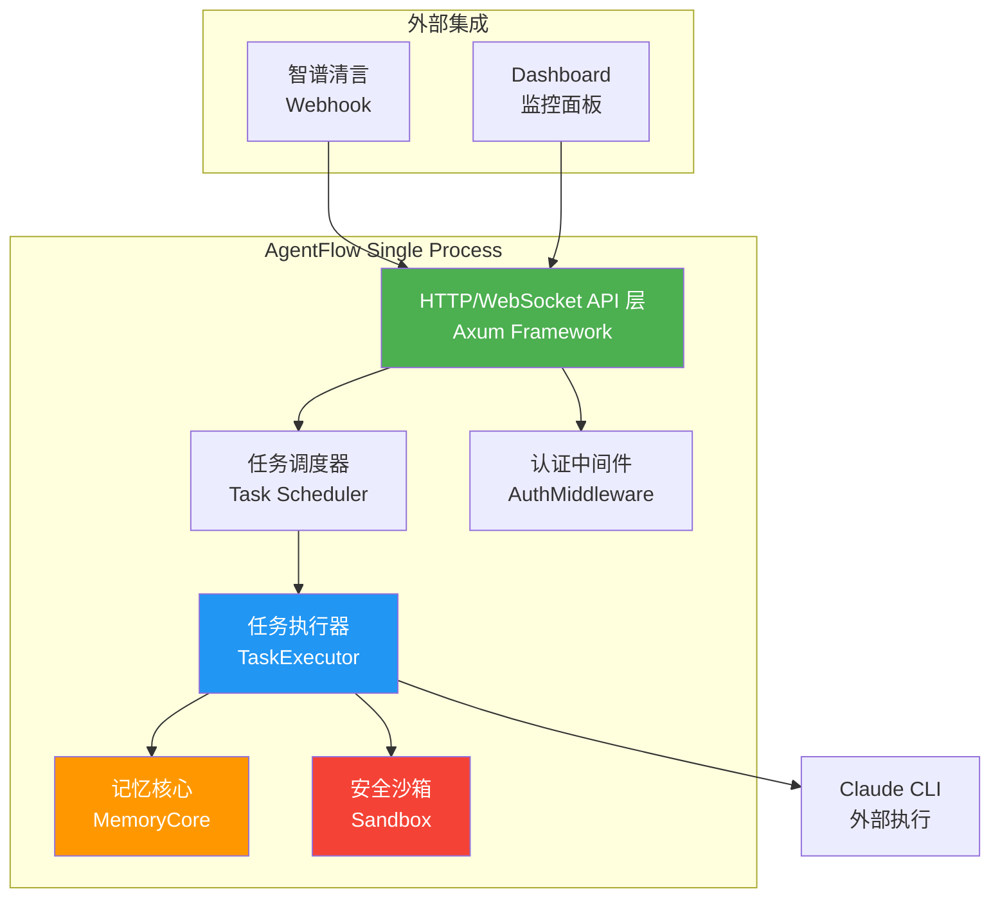

### 架构特点

| 特性 | 说明 |
|------|------|
| **单进程架构** | Master 服务器同时也是 Worker，无需独立进程 |
| **零依赖运行** | 单一二进制文件，无需 Node.js 或其他运行时 |
| **异步执行** | 基于 Tokio 异步运行时，支持高并发 |
| **直接执行** | 通过 tokio::process 直接调用 Claude CLI |
| **内存安全** | Rust 保证内存安全和线程安全 |
| **低资源占用** | 空闲内存 < 100MB，启动时间 < 1 秒 |

---

## 核心组件

### 1. HTTP/WebSocket API 层

**文件**: `rust/agentflow-master/src/routes/`

**职责**:
- RESTful API 服务
- WebSocket 实时通信
- 请求路由和分发

**核心 API 端点**:

| 端点 | 方法 | 功能 |
|------|------|------|
| `/health` | GET | 健康检查 |
| `/api/v1/login` | POST | 用户登录 |
| `/api/v1/tasks` | GET/POST | 任务列表/创建 |
| `/api/v1/tasks/:id` | GET/DELETE | 获取/删除任务 |
| `/api/v1/tasks/:id/execute` | POST | 执行任务 |
| `/api/v1/tasks/:id/cancel` | POST | 取消任务 |
| `/api/v1/memory/search` | GET/POST | 搜索记忆 |
| `/api/v1/memory/:key` | GET/DELETE | 获取/删除记忆 |
| `/ws/task/:id` | WebSocket | 任务实时日志 |

**代码结构**:
```rust
pub fn create_routes() -> Router<AppState> {
    Router::new()
        .route("/health", get(health_check))
        .route("/api/v1/tasks", post(create_task).get(list_tasks))
        .route("/ws/task/:id", get(task_websocket))
        // ... 更多路由
}
```

---

### 2. 任务调度器 (Task Scheduler)

**文件**: `rust/agentflow-core/src/executor/mod.rs`

**职责**:
- 任务队列管理
- 优先级调度
- 并发控制
- 超时管理

**核心数据结构**:
```rust
pub struct Task {
    pub id: i64,
    pub title: String,
    pub description: String,
    pub status: TaskStatus,
    pub priority: TaskPriority,
    pub created_at: DateTime<Utc>,
    pub started_at: Option<DateTime<Utc>>,
    pub completed_at: Option<DateTime<Utc>>,
}

pub enum TaskStatus {
    Pending,
    Running,
    Completed,
    Failed,
    Cancelled,
}

pub enum TaskPriority {
    Low = 250,
    Medium = 500,
    High = 750,
    Urgent = 1000,
}
```

**调度流程**:
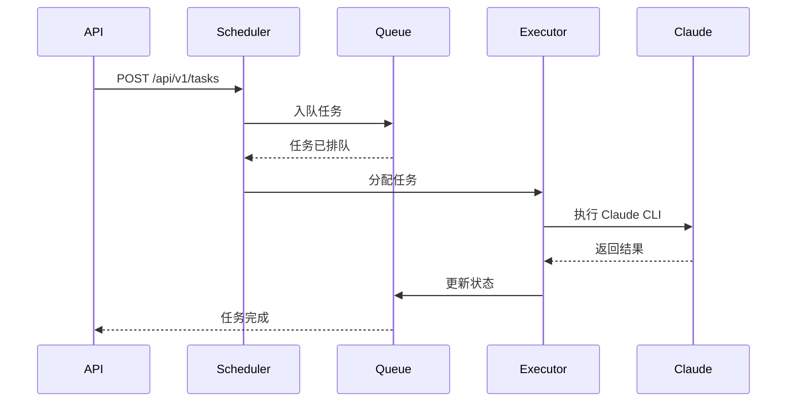

---

### 3. 任务执行器 (TaskExecutor)

**文件**: `rust/agentflow-master/src/executor.rs`

**职责**:
- 执行 Claude CLI
- 管理 Prompt 构建
- 处理进程超时
- 收集执行日志

**核心功能**:
```rust
pub struct TaskExecutor {
    max_concurrent_tasks: usize,
    task_timeout: u64,
    workspace: PathBuf,
}

impl TaskExecutor {
    pub async fn execute_task(&self, task: &Task) -> Result<TaskExecution> {
        // 1. 构建 Prompt
        let prompt = self.build_prompt(task).await?;

        // 2. 启动 Claude CLI 进程
        let process = Command::new("claude")
            .args(["--prompt", &prompt])
            .stdout(Stdio::piped())
            .spawn()?;

        // 3. 等待完成或超时
        let output = timeout(
            Duration::from_secs(self.task_timeout),
            process.wait_with_output()
        ).await??;

        // 4. 解析结果
        Ok(TaskExecution::from(output))
    }
}
```

**Prompt 构建流程**:
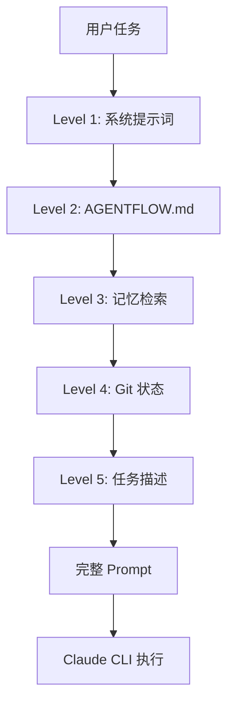

**四级 Prompt 架构**:

| 级别 | 内容 | 来源 |
|------|------|------|
| Level 1 | 系统提示词 | 硬编码 (prompt_builder.rs) |
| Level 2 | 项目配置 | {workspace}/AGENTFLOW.md |
| Level 3 | 历史记忆 | MemoryCore 检索 (Top 3) |
| Level 4 | Git 状态 | Git 仓库信息 |
| Level 5 | 用户任务 | 请求参数 |

---

### 4. 记忆核心 (MemoryCore)

**文件**: `rust/agentflow-core/src/memory/`

**职责**:
- 任务记忆存储
- 语义检索
- 上下文注入
- TTL 管理

**存储架构**:
```rust
pub struct MemoryCore {
    backend: MemoryBackend,
    default_ttl: Duration,
    max_entries: usize,
}

pub enum MemoryBackend {
    Memory,              // 内存存储
    SQLite,              // SQLite 持久化
    Redis,               // 分布式缓存
}
```

**记忆类型**:
```rust
pub struct WorkerMemory {
    pub key: String,
    pub value: serde_json::Value,
    pub category: MemoryCategory,
    pub tags: Vec<String>,
    pub created_at: DateTime<Utc>,
    pub expires_at: Option<DateTime<Utc>>,
}

pub enum MemoryCategory {
    Execution,           // 执行记录
    Result,              // 执行结果
    Error,               // 错误信息
    Context,             // 上下文信息
    Skill,               // 技能经验
}
```

**记忆检索流程**:
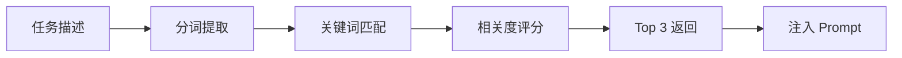

---

### 5. 安全沙箱 (Sandbox)

**文件**: `rust/agentflow-core/src/sandbox.rs`

**职责**:
- 路径白名单
- 符号链接保护
- 进程隔离
- 资源限制

**安全特性**:
```rust
pub struct Sandbox {
    enabled: bool,
    workspace: PathBuf,
    allow_network: bool,
    max_memory: Option<ByteSize>,
    max_cpu: Option<i32>,
    timeout: Option<Duration>,
}

impl Sandbox {
    pub fn validate_path(&self, path: &Path) -> Result<PathBuf> {
        // 1. 路径白名单检查
        // 2. 路径遍历攻击检测 (../)
        // 3. 符号链接递归解析
        // 4. 最终路径验证
    }
}
```

**安全保护**:

| 保护类型 | 实现 | 说明 |
|---------|------|------|
| 路径白名单 | whitelist | 只允许访问指定目录 |
| 路径遍历保护 | 检测 `../` | 阻止目录遍历攻击 |
| 符号链接保护 | 递归解析 (最大 10 层) | 防止符号链接逃逸 |
| 进程超时 | SIGTERM → SIGKILL | 自动终止超时进程 |
| 进程组清理 | killpg | 清理所有子进程 |

---

### 6. 认证中间件 (AuthMiddleware)

**文件**: `rust/agentflow-master/src/auth_middleware.rs`

**职责**:
- 用户认证
- API Key 验证
- Session 管理
- 权限控制

**认证方式**:
```rust
pub struct AuthConfig {
    pub enabled: bool,
    pub username: String,
    pub password: String,
    pub session_ttl: u64,
    pub api_key_secret: String,
}

// 1. 用户名密码认证 (前端)
// Authorization: Bearer <session_id>

// 2. API Key 认证 (Master 之间)
// Authorization: Bearer sk_<timestamp>_<signature>
```

**认证流程**:
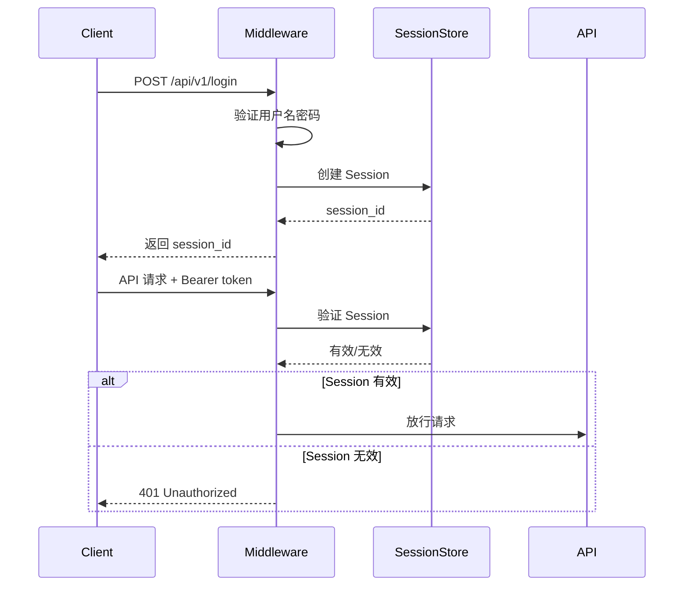

---

## 技术栈

### 后端技术栈

| 组件 | 技术 | 版本 | 用途 |
|------|------|------|------|
| **语言** | Rust | 1.93+ | 系统实现 |
| **Web 框架** | Axum | 0.7 | HTTP/WebSocket 服务 |
| **异步运行时** | Tokio | 1.x | 异步任务调度 |
| **数据库** | SQLite | 3.x + SQLx | 持久化存储 |
| **序列化** | Serde | 1.x | JSON 序列化 |
| **日志** | Tracing | 0.1 | 结构化日志 |
| **CLI 执行** | tokio::process | - | 子进程管理 |

### 依赖关系

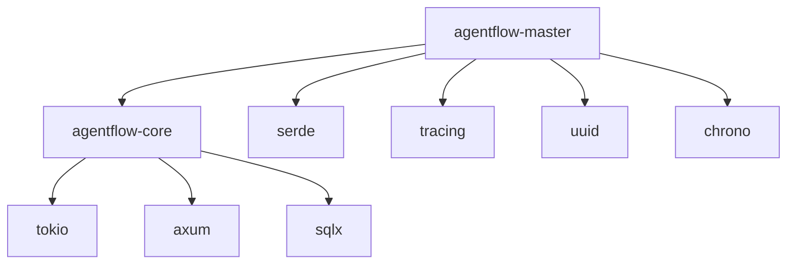

**Cargo.toml 核心依赖**:
```toml
[dependencies]
tokio = { version = "1", features = ["full"] }
axum = "0.7"
sqlx = { version = "0.7", features = ["sqlite", "runtime-tokio"] }
serde = { version = "1", features = ["derive"] }
tracing = "0.1"
tracing-subscriber = "0.3"
uuid = { version = "1", features = ["v4"] }
chrono = "0.4"
anyhow = "1"
```

---

## 数据流

### 任务创建流程

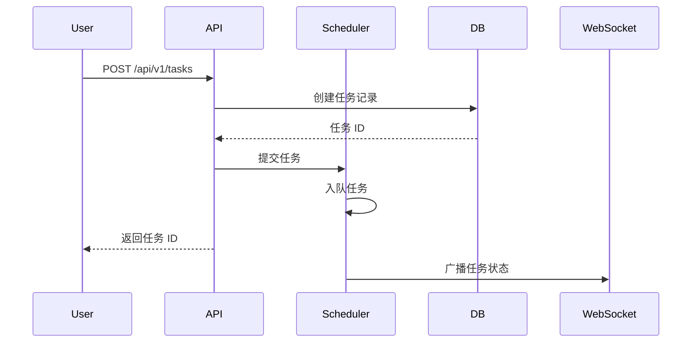

### 任务执行流程

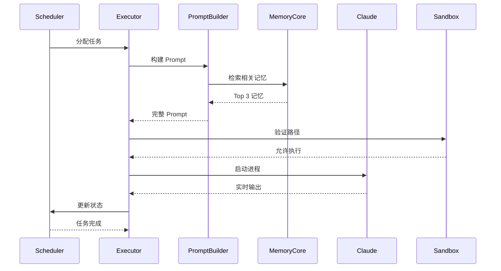

### 数据持久化

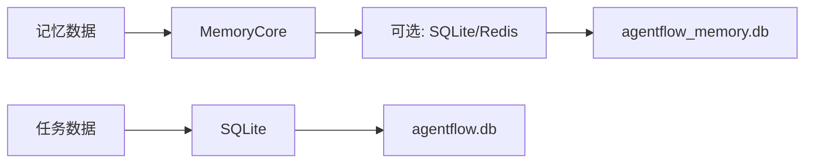

**数据库表结构**:

```sql
-- 任务表
CREATE TABLE tasks (
    id INTEGER PRIMARY KEY AUTOINCREMENT,
    title TEXT NOT NULL,
    description TEXT NOT NULL,
    status TEXT NOT NULL,
    priority INTEGER NOT NULL,
    created_at DATETIME NOT NULL,
    started_at DATETIME,
    completed_at DATETIME,
    result TEXT,
    error TEXT
);

-- 记忆表 (SQLite 后端)
CREATE TABLE memories (
    key TEXT PRIMARY KEY,
    value TEXT NOT NULL,
    category TEXT NOT NULL,
    tags TEXT,
    created_at DATETIME NOT NULL,
    expires_at DATETIME
);
```

---

## 通信协议

### REST API

**Base URL**: `http://localhost:6767/api/v1`

**认证方式**:
```
Authorization: Bearer <session_id>
Authorization: Bearer sk_<timestamp>_<signature>
```

**请求格式**:
```bash
# 创建任务
curl -X POST http://localhost:6767/api/v1/tasks \
  -H "Content-Type: application/json" \
  -H "Authorization: Bearer <session_id>" \
  -d '{
    "title": "测试任务",
    "description": "echo Hello World",
    "priority": "high"
  }'
```

**响应格式**:
```json
{
  "success": true,
  "data": {
    "id": 1,
    "title": "测试任务",
    "status": "pending",
    "priority": "high",
    "created_at": "2026-01-28T10:00:00Z"
  }
}
```

### WebSocket API

**端点**: `ws://localhost:6767/ws/task/:id`

**消息格式**:
```json
{
  "type": "log",
  "timestamp": "2026-01-28T10:00:01Z",
  "data": {
    "level": "info",
    "message": "Starting task execution..."
  }
}
```

**消息类型**:
- `log`: 日志消息
- `status`: 状态更新
- `result`: 执行结果
- `error`: 错误信息
- `complete`: 任务完成

### SSE (Server-Sent Events)

**端点**: `GET /api/v1/tasks/:id/execute?stream=true`

**Content-Type**: `text/event-stream`

**事件流**:
```
event: log
data: {"message": "Starting..."}

event: log
data: {"message": "Running test..."}

event: complete
data: {"result": "Success"}
```

---

## 部署架构

### 单机部署 (推荐)

**适用场景**: 开发环境、小型项目

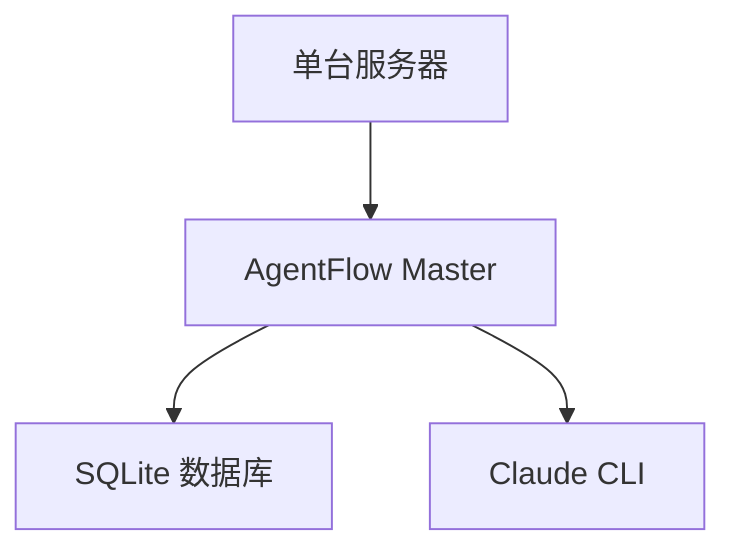

**启动命令**:
```bash
# 本地模式
agentflow server local

# 云端模式 (支持 Webhook)
agentflow server cloud

# 仅规划模式
agentflow server planner-only
```

### 分布式部署 (v0.4.0+)

**适用场景**: 生产环境、大规模任务

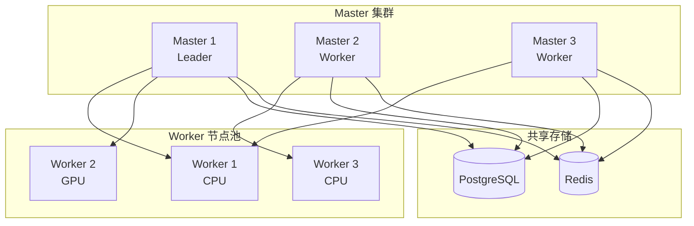

**分布式特性**:

| 特性 | 说明 |
|------|------|
| **Leader 选举** | Raft 共识算法 |
| **任务依赖** | DAG 工作流 |
| **优先级队列** | 智能调度 |
| **Worker 注册** | 健康检查 + 负载均衡 |
| **Agent 通信** | 点对点 + 广播 |
| **分布式锁** | 跨节点协调 |

### Docker 容器化

**Dockerfile**:
```dockerfile
FROM rust:1.93 as builder
WORKDIR /app
COPY . .
RUN cargo build --release

FROM debian:bookworm-slim
RUN apt-get update && apt-get install -y ca-certificates
COPY --from=builder /app/target/release/agentflow-master /usr/local/bin/
EXPOSE 6767
CMD ["agentflow-master"]
```

**docker-compose.yml**:
```yaml
version: '3.8'
services:
  agentflow:
    image: agentflow:latest
    ports:
      - "6767:6767"
    environment:
      - AGENTFLOW_SERVER_PORT=6767
      - AGENTFLOW_DATABASE_URL=sqlite://agentflow.db
    volumes:
      - ./data:/app/data
```

---

## 安全模型

### 多层安全防护

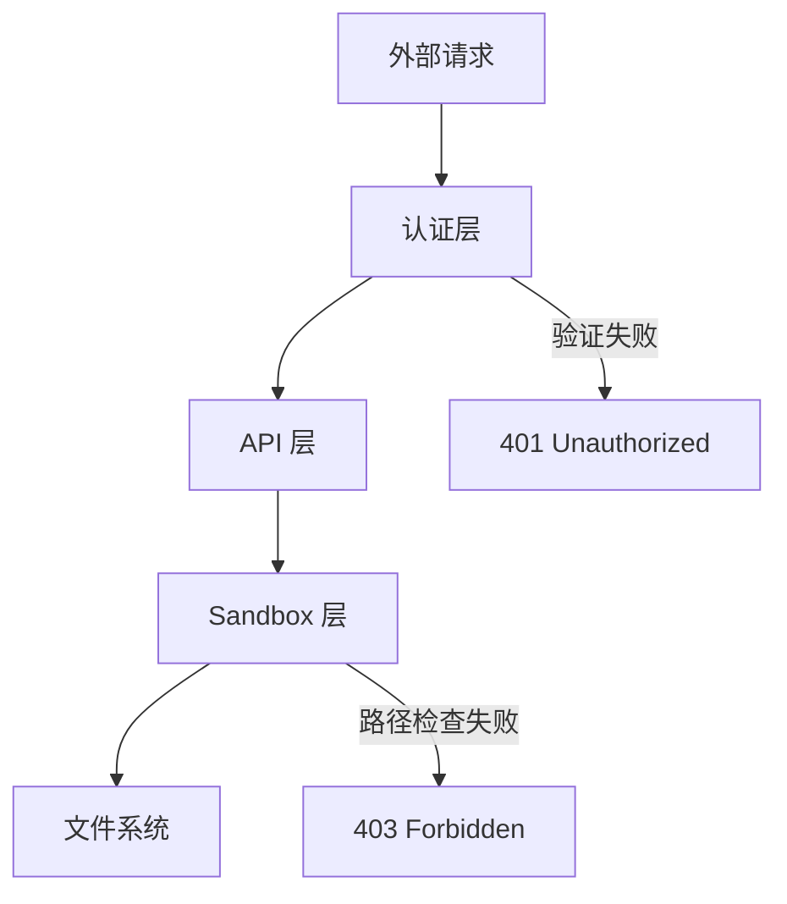

### 安全特性

#### 1. 认证和授权

| 特性 | 实现 |
|------|------|
| **用户认证** | 用户名 + 密码 |
| **API Key** | 签名验证 (HMAC-SHA256) |
| **Session 管理** | TTL + 自动过期 |
| **权限控制** | 基于角色的访问控制 (RBAC) |

#### 2. 网络安全

| 特性 | 实现 |
|------|------|
| **TLS/SSL** | 可选的 HTTPS 支持 |
| **Webhook 签名** | HMAC-SHA256 验证 |
| **IP 白名单** | 基于 CIDR 的访问控制 |
| **速率限制** | 令牌桶算法 |

#### 3. 沙箱隔离

| 特性 | 实现 |
|------|------|
| **路径白名单** | 只允许访问指定目录 |
| **路径遍历保护** | 检测并阻止 `../` |
| **符号链接保护** | 递归解析 (最大 10 层) |
| **进程隔离** | 独立进程组 |
| **资源限制** | CPU/内存/超时限制 |

#### 4. 数据安全

| 特性 | 实现 |
|------|------|
| **敏感数据加密** | 环境变量加密存储 |
| **日志脱敏** | 自动过滤敏感信息 |
| **审计日志** | 记录所有关键操作 |
| **备份恢复** | SQLite 数据库备份 |

### 安全最佳实践

1. **启用认证**:
   ```toml
   [auth]
   enabled = true
   username = "admin"
   password = "strong_password_here"
   ```

2. **配置 Webhook 签名**:
   ```toml
   [webhook]
   secret = "your-webhook-secret-key"
   ip_whitelist_enabled = true
   ip_whitelist = ["203.119.0.0/16"]
   ```

3. **限制沙箱访问**:
   ```toml
   [sandbox]
   enabled = true
   whitelist = ["/var/lib/agentflow", "/data/projects"]
   ```

4. **使用环境变量**:
   ```bash
   export AGENTFLOW_AUTH_USERNAME="admin"
   export AGENTFLOW_AUTH_PASSWORD="$(openssl rand -base64 32)"
   ```

---

## 性能特性

### 性能指标

| 指标 | 值 | 说明 |
|------|------|------|
| **内存占用** | < 100MB | 空闲状态 |
| **启动时间** | < 1 秒 | 冷启动 |
| **并发任务** | 10+ | 可配置 |
| **API 响应** | < 10ms | P95 延迟 |
| **任务吞吐** | 100+ 任务/分钟 | 取决于任务类型 |

### 性能优化

#### 1. 异步并发

```rust
// 使用 Tokio 异步运行时
let tasks = Vec::new();
for task in pending_tasks {
    let handle = tokio::spawn(execute_task(task));
    tasks.push(handle);
}

// 等待所有任务完成
for handle in tasks {
    handle.await??;
}
```

#### 2. 连接池

```rust
// 数据库连接池
let pool = SqlitePool::connect_with(database_url)
    .await?
    .max_connections(20);
```

#### 3. 缓存策略

```rust
// 内存缓存
let memory = MemoryCore::new(MemoryBackend::Memory);
memory.default_ttl = Duration::from_secs(3600);
```

#### 4. 批量处理

```rust
// 批量写入数据库
transaction.execute_batch(&[
    "INSERT INTO tasks ...",
    "INSERT INTO tasks ...",
]).await?;
```

### 性能监控

**日志级别**:
```bash
# 开发环境
RUST_LOG=debug

# 生产环境
RUST_LOG=info
```

**关键日志**:
```
[task_executor] Task 123 started
[task_executor] Task 123 completed in 2.5s
[memory] Cache hit: 85%
[scheduler] Queue depth: 5 tasks
```

---

## 扩展性

### 插件系统 (规划中)

```rust
pub trait Plugin {
    fn name(&self) -> &str;
    fn on_task_start(&self, task: &Task);
    fn on_task_complete(&self, task: &Task, result: &Result);
}
```

### 自定义 Executor

```rust
pub trait Executor {
    async fn execute(&self, task: &Task) -> Result<TaskExecution>;
}

// Docker Executor
pub struct DockerExecutor {
    image: String,
}

// Kubernetes Executor
pub struct K8sExecutor {
    namespace: String,
}
```

### 自定义 Memory Backend

```rust
pub trait MemoryBackend {
    async fn get(&self, key: &str) -> Option<Value>;
    async fn set(&self, key: &str, value: Value) -> Result<()>;
    async fn search(&self, query: &str) -> Vec<MemoryEntry>;
}
```

---

## 版本历史

| 版本 | 日期 | 主要特性 |
|------|------|---------|
| v0.1.0 | 2024-12 | 初始版本 (Node.js) |
| v0.2.0 | 2025-01 | 记忆工作流系统 |
| v0.2.1 | 2025-01 | Skill 引导增强 |
| v0.3.0 | 2025-01 | Rust 重写 (v3) |
| v0.4.0 | 2026-01 | 分布式执行 + 认证系统 |

---

## 相关文档

- **[配置文档](CONFIGURATION.md)** - 完整配置参考
- **[功能文档](FEATURES.md)** - 功能特性说明
- **[API 文档](rust/agentflow-master/API.md)** - REST API 参考
- **[分布式系统](DISTRIBUTED_EXECUTION_SYSTEM.md)** - 分布式架构
- **[智谱集成](ZHIPU_INTEGRATION.md)** - 智谱清言集成
- **[安装指南](README.md)** - 快速开始

---

**最后更新**: 2026-01-28
**文档版本**: 1.0
