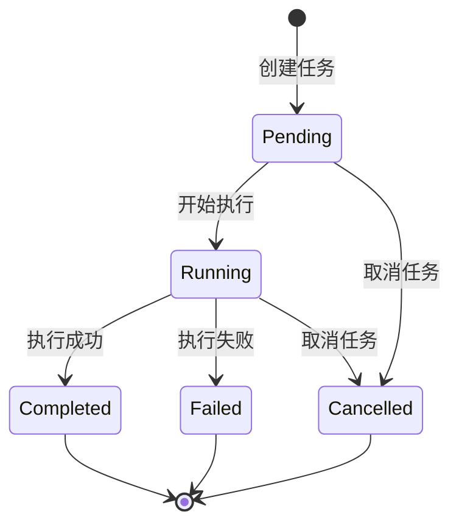
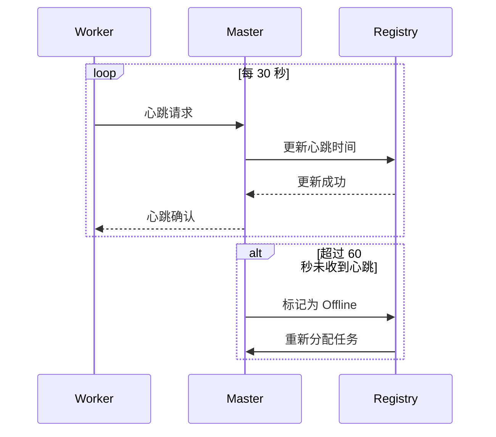
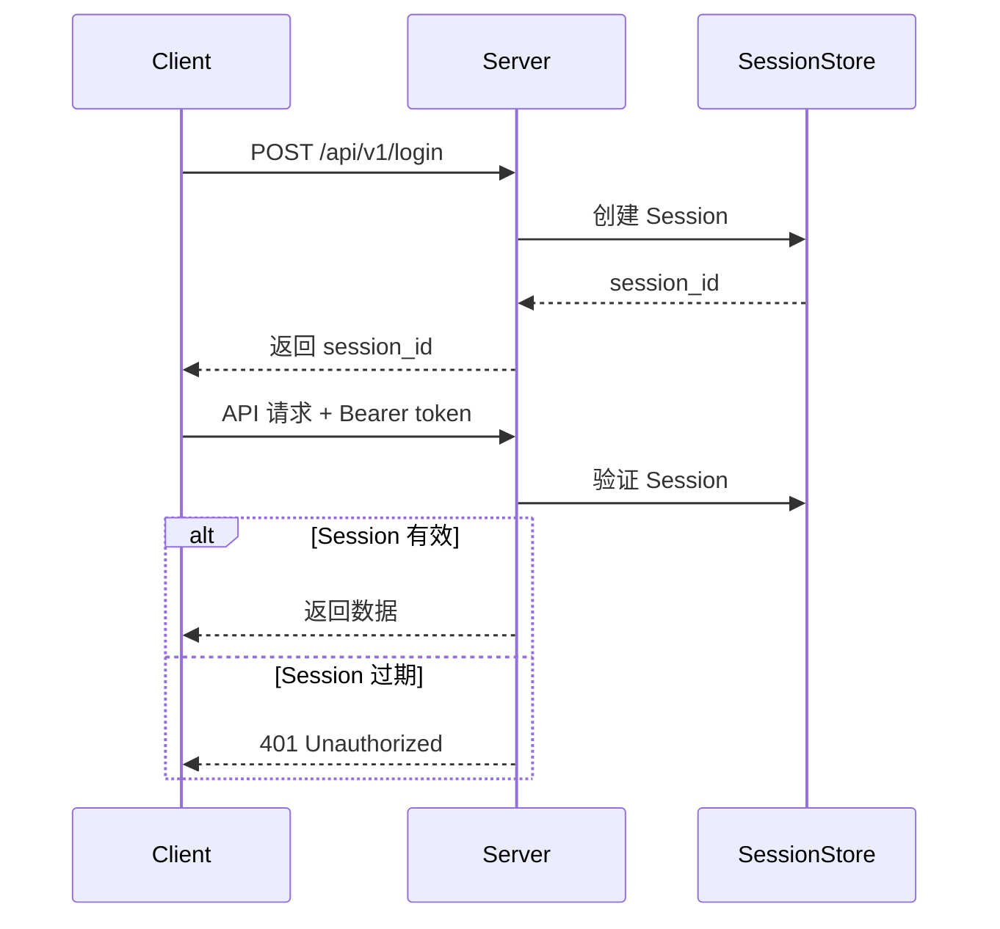
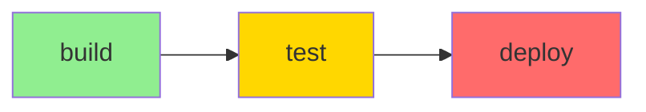
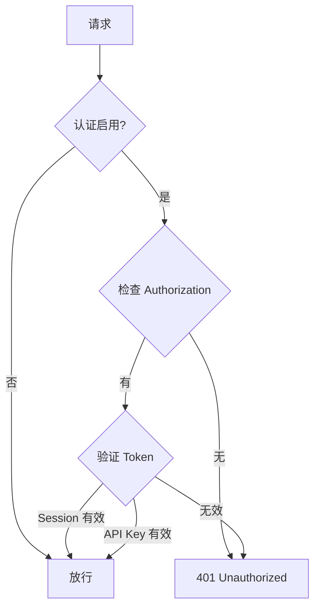

# AgentFlow 功能文档

**版本**: v0.4.0
**最后更新**: 2026-01-28
**维护者**: AgentFlow Team

---

## 目录

- [核心功能](#核心功能)
- [高级功能](#高级功能)
- [集成功能](#集成功能)
- [API 功能](#api-功能)
- [版本对比](#版本对比)
- [使用场景](#使用场景)

---

## 核心功能

### 1. 任务管理

AgentFlow 提供完整的任务生命周期管理。

#### 任务创建

```bash
curl -X POST http://localhost:6767/api/v1/tasks \
  -H "Content-Type: application/json" \
  -H "Authorization: Bearer <session_id>" \
  -d '{
    "title": "测试任务",
    "description": "echo Hello World",
    "priority": "high"
  }'
```

**任务属性**:

| 属性 | 类型 | 必填 | 说明 |
|------|------|------|------|
| `id` | integer | 否 | 任务 ID (自动生成) |
| `title` | string | 是 | 任务标题 |
| `description` | string | 是 | 任务描述 (自然语言) |
| `priority` | string | 否 | 优先级 (low/medium/high/urgent) |
| `status` | string | 否 | 状态 (pending/running/completed/failed) |

#### 任务状态管理



#### 任务列表查询

```bash
# 查询所有任务
curl http://localhost:6767/api/v1/tasks

# 按状态过滤
curl http://localhost:6767/api/v1/tasks?status=running

# 按优先级排序
curl http://localhost:6767/api/v1/tasks?sort=priority&order=desc

# 分页查询
curl http://localhost:6767/api/v1/tasks?page=1&per_page=10
```

**查询参数**:

| 参数 | 类型 | 说明 |
|------|------|------|
| `status` | string | 按状态过滤 |
| `priority` | string | 按优先级过滤 |
| `sort` | string | 排序字段 (created_at/priority) |
| `order` | string | 排序方向 (asc/desc) |
| `page` | integer | 页码 (从 1 开始) |
| `per_page` | integer | 每页数量 (默认 20) |

#### 任务执行

```bash
# 同步执行
curl -X POST http://localhost:6767/api/v1/tasks/1/execute

# 异步执行 (SSE 流式响应)
curl -X POST http://localhost:6767/api/v1/tasks/1/execute \
  -H "Accept: text/event-stream"
```

**执行模式**:

| 模式 | Content-Type | 说明 |
|------|-------------|------|
| **同步** | application/json | 等待任务完成后返回结果 |
| **SSE 流式** | text/event-stream | 实时返回执行日志 |

#### 任务取消

```bash
curl -X POST http://localhost:6767/api/v1/tasks/1/cancel
```

**取消策略**:
- `Pending` 状态: 立即从队列移除
- `Running` 状态: 发送 SIGTERM 信号，等待 5 秒后强制 SIGKILL

---

### 2. Worker 管理

在 v0.4.0+ 版本中，AgentFlow 支持分布式 Worker 节点管理。

#### Worker 注册

```bash
# 启动 Worker
cargo run --bin agentflow-worker \
  --master-url http://localhost:6767 \
  --cpu-cores 8 \
  --memory-mb 16384 \
  --gpu-count 1
```

**Worker 信息**:

```json
{
  "worker_id": "worker-1",
  "worker_name": "Worker 1",
  "platform": "linux",
  "status": "active",
  "resources": {
    "cpu_cores": 8,
    "total_memory_mb": 16384,
    "available_memory_mb": 16000,
    "gpu_count": 1
  },
  "capabilities": ["bash", "python", "docker"]
}
```

#### Worker 健康检查

```bash
# 查询所有 Worker
curl http://localhost:6767/api/v1/workers

# 查询健康的 Worker
curl http://localhost:6767/api/v1/workers?status=healthy

# 查询最空闲的 Worker
curl http://localhost:6767/api/v1/workers?sort=load&order=asc
```

**Worker 状态**:

| 状态 | 说明 |
|------|------|
| `Active` | 空闲可用 |
| `Busy` | 正在执行任务 |
| `Offline` | 离线 (心跳超时) |
| `Draining` | 优雅关闭中 |

#### 心跳机制



**心跳配置**:
```toml
[server]
worker_heartbeat_timeout = 60  # 秒
```

---

### 3. 记忆系统

AgentFlow 的记忆系统自动从任务执行中提取知识，并在未来任务中重用。

#### 记忆存储

```rust
// 自动记忆 (任务完成后自动提取)
memory.store(
    "task-123-result",
    json!({
        "summary": "成功修复了 Shader 编译错误",
        "solution": "删除 Cache/ 目录",
        "files_modified": ["src/renderer.cpp"]
    }),
    MemoryCategory::Result,
    vec!["bug-fix".to_string(), "shader".to_string()]
).await?;
```

**记忆分类**:

| 分类 | 说明 | 示例 |
|------|------|------|
| `Execution` | 执行记录 | 命令、参数、执行时间 |
| `Result` | 执行结果 | 输出、成功案例 |
| `Error` | 错误信息 | 失败原因、解决方案 |
| `Context` | 上下文信息 | 项目结构、配置 |
| `Skill` | 技能经验 | 最佳实践、技巧 |

#### 记忆检索

```bash
# 关键词搜索
curl http://localhost:6767/api/v1/memory/search?q=shader

# 按分类过滤
curl http://localhost:6767/api/v1/memory/search?category=error

# 按标签过滤
curl http://localhost:6767/api/v1/memory/search?tags=bug-fix

# Top-K 检索
curl http://localhost:6767/api/v1/memory/search?top_k=3
```

**检索参数**:

| 参数 | 类型 | 说明 |
|------|------|------|
| `q` | string | 搜索关键词 |
| `category` | string | 按分类过滤 |
| `tags` | string | 按标签过滤 (逗号分隔) |
| `top_k` | integer | 返回数量 (默认 3) |

#### 记忆注入

记忆会自动注入到 Prompt 中：

```markdown
## Relevant Historical Experience

[2025-01-10] **Shader 编译错误修复**
- 问题: DX12 Shader 编译失败
- 解决: 删除 Cache/ 目录，重新编译
- 关键文件: src/renderer.cpp
- 参考: [记忆 ID: mem-123]

请参考以上经验处理当前任务。
```

#### 记忆管理

```bash
# 查看记忆统计
curl http://localhost:6767/api/v1/memory/stats

# 删除过期记忆
curl -X DELETE http://localhost:6767/api/v1/memory/expired

# 导出记忆
curl http://localhost:6767/api/v1/memory/export > memory-backup.json
```

---

### 4. Skills 系统

Skills 系统通过项目级配置指导 Agent 的行为。

#### AGENTFLOW.md 配置

在项目根目录创建 `AGENTFLOW.md`:

```markdown
# AgentFlow 项目配置

## 构建系统

### Windows
```bash
msbuild DiveAdstra.sln /p:Configuration=Release
```

### Linux
```bash
make release
```

## 测试工作流

- **单元测试**: `./bin/test --suite=unit`
- **集成测试**: `./bin/test --suite=integration`
- **性能测试**: `./bin/test --suite=performance`

⚠️ **注意**: 不要运行 `make test`，会超时！

## 关键技能 (Do's and Don'ts)

### ✅ Do's
- 提交前必须运行 `linter`
- 修改 C++ 代码后重新编译 Shader
- 使用 `clang-format` 格式化代码

### ❌ Don'ts
- 不要修改 `third_party/` 目录
- 不要提交 `*.log` 文件
- 不要使用 `C++ exceptions` (项目禁用)

### 💡 Special Skills
- **Shader 编译错误**: 删除 `Cache/` 目录
- **内存泄漏**: 使用 `valgrind --leak-check=full`
- **性能优化**: 优先使用 `--release` 模式测试

## 调试策略

### 崩溃问题
1. 检查 `Logs/` 目录
2. 查看核心转储文件
3. 运行 `gdb ./bin/DiveAdstra core`

### 性能问题
1. 使用 `perf record` 分析热点
2. 检查 `Resources/` 资源加载
3. 启用 Profiler: `--profile`

## Git 工作流

- 主分支: `main`
- 功能分支: `feature/*`
- 修复分支: `hotfix/*`

提交格式: `type(scope): description`
示例: `fix(renderer):修复 Shader 编译错误`
```

#### 配置加载

```rust
pub struct ProjectConfig {
    pub build_system: BuildSystem,
    pub test_workflow: TestWorkflow,
    pub critical_skills: Vec<Skill>,
    pub debugging_strategy: DebugStrategy,
    pub git_workflow: GitWorkflow,
}

// 自动加载 {workspace}/AGENTFLOW.md
let config = ProjectConfig::from_workspace(&workspace).await?;
```

#### 四级 Prompt 架构

```
Level 1 [Hardcoded]   → "AgentFlow Execution Engine"
       ↓
Level 2 [Project]      → AGENTFLOW.md
       ↓
Level 3 [Memory]       → Top 3 相关记忆
       ↓
Level 4 [Git]          → 当前分支、状态
       ↓
Level 5 [Task]         → 用户任务描述
```

---

### 5. 认证系统

#### 用户认证

```bash
# 登录
curl -X POST http://localhost:6767/api/v1/login \
  -H "Content-Type: application/json" \
  -d '{
    "username": "admin",
    "password": "admin"
  }'

# 响应
{
  "success": true,
  "message": "登录成功",
  "session_id": "550e8400-e29b-41d4-a716-446655440000"
}
```

#### API Key 认证

用于 Master 之间通信：

```bash
# 生成 API Key
openssl rand -hex 32

# 使用 API Key
curl http://localhost:6767/api/v1/tasks \
  -H "Authorization: Bearer sk_<timestamp>_<signature>"
```

**API Key 格式**: `sk_{timestamp}_{signature}`

```rust
pub fn verify_api_key(&self, key: &str) -> Result<bool> {
    // 1. 解析 API Key
    // 2. 验证签名 (HMAC-SHA256)
    // 3. 检查时间戳 (5 分钟有效期)
    Ok(true)
}
```

#### Session 管理

```toml
[auth]
enabled = true
username = "admin"
password = "strong_password_here"
session_ttl = 86400  # 24 小时
```

**Session 流程**:



---

## 高级功能

### 1. 分布式锁

用于跨节点协调：

```rust
use agentflow_master::distributed_lock::DistributedLock;

// 获取锁
let lock = DistributedLock::new(db_pool, "node1", Duration::from_secs(30));

// 阻塞式获取锁
{
    let lock = lock.acquire_blocking("deploy-lock", Duration::from_secs(60)).await?;

    // 执行临界区代码
    deploy_application().await?;

    // 锁自动释放 (Drop)
}
```

**自动续期锁**:
```rust
// 后台自动续期，防止锁过期
let auto_lock = AutoRenewLock::acquire(arc_lock, "my-lock", None).await?;

// 执行长时间任务
long_running_task().await?;

// 离开作用域时自动释放
```

---

### 2. 工作流编排

支持 DAG (有向无环图) 工作流：

```yaml
workflow:
  id: "ci-pipeline"
  name: "CI 流水线"
  tasks:
    - task_id: "build"
      title: "构建项目"
      dependencies: []
      priority: "high"

    - task_id: "test"
      title: "运行测试"
      dependencies: ["build"]
      priority: "high"

    - task_id: "deploy"
      title: "部署到生产"
      dependencies: ["test"]
      priority: "medium"
```

**创建工作流**:
```bash
curl -X POST http://localhost:6767/api/v1/workflows \
  -H "Content-Type: application/json" \
  -d @workflow.yaml
```

**执行流程**:


**依赖管理**:
- 自动解析任务依赖
- 并行执行无依赖任务
- 失败时阻止下游任务

---

### 3. 任务依赖

支持任务之间的依赖关系：

```rust
pub struct TaskDependencyGraph {
    tasks: HashMap<String, TaskNode>,
    dependencies: HashMap<String, Vec<String>>,
}

impl TaskDependencyGraph {
    // 获取可执行任务 (所有依赖已完成)
    pub async fn get_ready_tasks(&self) -> Result<Vec<String>> {
        // 拓扑排序
        // 返回无依赖的任务
    }

    // 更新任务状态，触发下游任务
    pub async fn update_task_state(&self, task_id: &str, state: TaskState) -> Result<()> {
        // 更新状态
        // 检查下游任务是否可执行
    }
}
```

**示例**:
```
任务 A (无依赖) → 立即可执行
任务 B (依赖 A) → 等待 A 完成
任务 C (依赖 B) → 等待 B 完成
```

---

### 4. 检查点恢复

支持从检查点恢复任务执行：

```rust
pub struct Checkpoint {
    pub task_id: String,
    pub checkpoint_id: String,
    pub data: serde_json::Value,
    pub created_at: DateTime<Utc>,
}

// 创建检查点
async fn create_checkpoint(&self, data: Value) -> Result<Checkpoint> {
    // 保存当前状态
}

// 从检查点恢复
async fn restore_from_checkpoint(&self, checkpoint_id: &str) -> Result<Task> {
    // 恢复状态
    // 继续执行
}
```

**使用场景**:
- 长时间运行任务
- 易失性计算
- 断点续传

---

### 5. 优先级队列

基于优先级的任务调度：

```rust
pub enum TaskPriority {
    Urgent = 1000,  // 紧急任务 (最高)
    High = 750,     // 高优先级
    Medium = 500,   // 中等优先级
    Low = 250,      // 低优先级
}
```

**调度策略**:
1. 按优先级排序 (Urgent > High > Medium > Low)
2. 相同优先级按入队时间排序 (FIFO)
3. 支持动态调整优先级

**动态调整**:
```bash
# 提升任务优先级
curl -X PATCH http://localhost:6767/api/v1/tasks/1 \
  -H "Content-Type: application/json" \
  -d '{"priority": "urgent"}'
```

---

## 集成功能

### 1. Claude CLI 集成

AgentFlow 直接调用 Claude CLI 执行任务：

```rust
pub struct TaskExecutor {
    claude_path: PathBuf,
    workspace: PathBuf,
}

impl TaskExecutor {
    pub async fn execute_task(&self, prompt: &str) -> Result<String> {
        let output = Command::new("claude")
            .arg("--prompt")
            .arg(prompt)
            .current_dir(&self.workspace)
            .stdout(Stdio::piped())
            .stderr(Stdio::piped())
            .output()
            .await?;

        Ok(String::from_utf8_lossy(&output.stdout).to_string())
    }
}
```

**特性**:
- 直接执行 (无需包装)
- 实时输出流
- 超时控制
- 信号处理 (SIGTERM/SIGKILL)

---

### 2. 智谱清言集成

通过 Webhook 接收智谱清言的指令：

```toml
[zhipu]
enabled = true
api_key = "your-zhipu-api-key"
model = "glm-4"
callback_url = "https://your-domain.com/callback"
```

**Webhook 处理**:
```rust
pub async fn handle_webhook(
    Json(payload): Json<ZhipuWebhookPayload>,
) -> Result<impl IntoResponse> {
    // 1. 验证签名
    // 2. 解析意图
    // 3. 创建任务
    // 4. 返回结果
}
```

**使用流程**:
1. 用户在智谱清言发送消息
2. 智谱清言通过 Webhook 发送给 AgentFlow
3. AgentFlow 解析意图并执行任务
4. AgentFlow 将结果回传给智谱清言

---

### 3. Webhook 支持

支持通用 Webhook 接入：

```toml
[webhook]
enabled = true
secret = "your-webhook-secret"
path = "/api/v1/webhook"
ip_whitelist_enabled = true
ip_whitelist = ["203.119.0.0/16"]
rate_limit = 100  # 请求/分钟
```

**Webhook 请求格式**:
```json
{
  "event": "task.created",
  "timestamp": "2026-01-28T10:00:00Z",
  "data": {
    "title": "测试任务",
    "description": "echo Hello World",
    "priority": "high"
  }
}
```

**签名验证**:
```rust
pub fn verify_webhook_signature(&self, payload: &str, signature: &str) -> bool {
    let hmac = Hmac::<Sha256>::new_from_slice(self.secret.as_bytes())?;
    hmac.update(payload.as_bytes());
    let expected = hmac.finalize().into_bytes();
    let signature_bytes = hex::decode(signature)?;
    expected.as_slice() == signature_bytes.as_slice()
}
```

---

### 4. Git 集成

自动注入 Git 状态到 Prompt：

```rust
pub struct GitContext {
    pub branch: String,
    pub status: GitStatus,
    pub uncommitted_files: Vec<String>,
    pub recent_commits: Vec<GitCommit>,
}

pub async fn get_git_context(&self, workspace: &Path) -> Result<GitContext> {
    let repo = Repository::open(workspace)?;

    let branch = repo.head()?.shorthand()?.to_string();
    let status = repo.status()?;

    Ok(GitContext {
        branch,
        status,
        uncommitted_files: extract_files(&status),
        recent_commits: get_recent_commits(&repo, 5)?,
    })
}
```

**注入示例**:
```markdown
## Git 状态
- 分支: feature/new-ui
- 未提交文件: 3 个
  - M src/components/Button.tsx
  - A src/components/Input.tsx
  - D src/utils/old.ts
- 最近提交: feat: add user authentication (2 小时前)
```

---

## API 功能

### REST API 端点

| 端点 | 方法 | 功能 | 认证 |
|------|------|------|------|
| `/health` | GET | 健康检查 | 否 |
| `/api/v1/login` | POST | 用户登录 | 否 |
| `/api/v1/tasks` | GET | 任务列表 | 是 |
| `/api/v1/tasks` | POST | 创建任务 | 是 |
| `/api/v1/tasks/:id` | GET | 获取任务 | 是 |
| `/api/v1/tasks/:id` | DELETE | 删除任务 | 是 |
| `/api/v1/tasks/:id/execute` | POST | 执行任务 | 是 |
| `/api/v1/tasks/:id/cancel` | POST | 取消任务 | 是 |
| `/api/v1/memory/search` | GET | 搜索记忆 | 是 |
| `/api/v1/memory/:key` | GET | 获取记忆 | 是 |
| `/api/v1/memory/:key` | DELETE | 删除记忆 | 是 |
| `/api/v1/memory/stats` | GET | 记忆统计 | 是 |
| `/api/v1/workers` | GET | Worker 列表 | 是 |
| `/api/v1/workflows` | POST | 创建工作流 | 是 |

**响应格式**:
```json
{
  "success": true,
  "data": { ... },
  "error": null,
  "timestamp": "2026-01-28T10:00:00Z"
}
```

**错误格式**:
```json
{
  "success": false,
  "data": null,
  "error": {
    "code": "TASK_NOT_FOUND",
    "message": "任务不存在",
    "details": { ... }
  },
  "timestamp": "2026-01-28T10:00:00Z"
}
```

---

### WebSocket API

**端点**: `ws://localhost:6767/ws/task/:id`

**连接**:
```javascript
const ws = new WebSocket('ws://localhost:6767/ws/task/1?token=<session_id>');

ws.onmessage = (event) => {
  const message = JSON.parse(event.data);
  console.log(message.type, message.data);
};
```

**消息类型**:

| 类型 | 说明 | 示例 |
|------|------|------|
| `log` | 日志消息 | `{"level": "info", "message": "..."}` |
| `status` | 状态更新 | `{"status": "running", "progress": 50}` |
| `result` | 执行结果 | `{"output": "Hello World"}` |
| `error` | 错误信息 | `{"error": "Task failed"}` |
| `complete` | 任务完成 | `{"success": true, "duration": 5.2}` |

**实时日志流**:
```javascript
ws.onmessage = (event) => {
  const msg = JSON.parse(event.data);
  if (msg.type === 'log') {
    console.log(`[${msg.data.level}] ${msg.data.message}`);
  }
};
```

---

### 认证机制

**Session 认证** (前端):
```
Authorization: Bearer <session_id>
```

**API Key 认证** (Master 之间):
```
Authorization: Bearer sk_<timestamp>_<signature>
```

**认证流程**:


---

## 版本对比

### AgentFlow 版本演进

| 版本 | 日期 | 主要特性 | 架构 |
|------|------|---------|------|
| v0.1.0 | 2024-12 | 初始版本 | Node.js (Master + Worker) |
| v0.2.0 | 2025-01 | 记忆工作流 | Node.js |
| v0.2.1 | 2025-01 | Skill 引导增强 | Node.js |
| v0.3.0 | 2025-01 | Rust 重写 (v3) | Rust (单进程) |
| v0.4.0 | 2026-01 | 分布式 + 认证 | Rust (分布式) |

### 功能对比

| 功能 | v0.2.1 | v0.3.0 | v0.4.0 |
|------|--------|--------|--------|
| **单进程架构** | ❌ | ✅ | ✅ |
| **任务管理** | ✅ | ✅ | ✅ |
| **记忆系统** | ✅ Markdown | ✅ SQLite | ✅ SQLite + Redis |
| **Skill 引导** | ✅ 基础 | ✅ 四级 Prompt | ✅ 四级 Prompt |
| **Git 集成** | ❌ | ❌ | ✅ |
| **认证系统** | ❌ | ❌ | ✅ Session + API Key |
| **分布式执行** | ❌ | ❌ | ✅ DAG + Worker |
| **Webhook** | ✅ | ✅ | ✅ 签名验证 |
| **智谱集成** | ❌ | ❌ | ✅ |
| **Dashboard** | ❌ | ❌ | ⏳ 规划中 |

### 性能对比

| 指标 | v0.2.1 (Node.js) | v0.3.0 (Rust) | v0.4.0 (Rust) |
|------|------------------|---------------|---------------|
| 内存占用 | ~300MB | < 100MB | < 100MB |
| 启动时间 | ~3 秒 | < 1 秒 | < 1 秒 |
| 并发任务 | 5 | 10+ | 50+ |
| API 延迟 | ~50ms | < 10ms | < 10ms |

---

## 使用场景

### 1. 开发自动化

**场景**: 自动化开发工作流

```bash
# 创建任务: 运行测试
agentflow task create "运行所有单元测试"

# 创建任务: 代码检查
agentflow task create "运行 linter 和 formatter"

# 创建任务: 构建项目
agentflow task create "编译生产版本"
```

**优势**:
- 自动调用正确的命令
- 遵循项目规范 (AGENTFLOW.md)
- 记忆经验 (避免重复错误)

---

### 2. CI/CD 流水线

**场景**: 持续集成/部署

```yaml
workflow:
  id: "ci-pipeline"
  tasks:
    - task_id: "lint"
      title: "代码检查"
      dependencies: []

    - task_id: "test"
      title: "运行测试"
      dependencies: ["lint"]

    - task_id: "build"
      title: "构建项目"
      dependencies: ["test"]

    - task_id: "deploy"
      title: "部署到生产"
      dependencies: ["build"]
```

**优势**:
- 自动化依赖管理
- 并行执行提高效率
- 失败时自动停止

---

### 3. 分布式任务执行

**场景**: 跨多个机器执行任务

```bash
# Master 节点
agentflow server --mode master --port 6767

# Worker 节点 1 (Linux)
agentflow worker --master-url http://master:6767

# Worker 节点 2 (Windows)
agentflow worker --master-url http://master:6767

# Worker 节点 3 (GPU)
agentflow worker --master-url http://master:6767 --gpu-count 1
```

**优势**:
- 自动负载均衡
- 故障自动恢复
- 水平扩展

---

### 4. 智能运维

**场景**: 自动化运维任务

```bash
# 通过智谱清言发送指令
"AgentFlow，帮我重启所有服务"

# AgentFlow 自动:
# 1. 解析意图
# 2. 创建任务
# 3. 执行重启
# 4. 返回结果
```

**优势**:
- 自然语言交互
- 自动记录日志
- 智能错误处理

---

### 5. 学习助手

**场景**: 从历史任务中学习

```bash
# 第一次遇到问题
agentflow task create "修复 Shader 编译错误"
# AgentFlow 记录: "删除 Cache/ 目录"

# 下次遇到类似问题
agentflow task create "Shader 又编译失败了"
# AgentFlow 自动应用: "根据历史经验，删除 Cache/ 目录"
```

**优势**:
- 经验自动积累
- 智能推荐解决方案
- 减少重复错误

---

## 最佳实践

### 1. 项目配置

始终在项目根目录创建 `AGENTFLOW.md`:

```markdown
# 项目配置

## 构建系统
- Linux: `make build`
- Windows: `msbuild project.sln`

## 测试命令
- 单元测试: `make test-unit`
- 集成测试: `make test-integration`

## 注意事项
- 不要运行 `make test` (会超时)
- 提交前必须运行 linter
```

---

### 2. 任务描述

使用清晰的自然语言描述:

❌ **不好**: `make`

✅ **好**: `运行单元测试，如果成功则构建项目`

---

### 3. 优先级设置

合理设置任务优先级:

| 场景 | 优先级 | 示例 |
|------|--------|------|
| 紧急修复 | `urgent` | 生产环境崩溃 |
| 重要任务 | `high` | 发布新版本 |
| 常规任务 | `medium` | 代码重构 |
| 低优先级 | `low` | 文档更新 |

---

### 4. 记忆管理

定期清理过期记忆:

```bash
# 查看记忆统计
curl http://localhost:6767/api/v1/memory/stats

# 删除 30 天前的记忆
curl -X DELETE http://localhost:6767/api/v1/memory?before=2025-12-29
```

---

### 5. 安全配置

生产环境必须启用认证:

```toml
[auth]
enabled = true
username = "admin"
password = "$(openssl rand -base64 32)"
session_ttl = 86400

[webhook]
secret = "$(openssl rand -hex 32)"
ip_whitelist_enabled = true
```

---

## 常见问题

### Q1: 如何重置 Admin 密码？

```bash
# 方法 1: 使用环境变量
export AGENTFLOW_AUTH_PASSWORD="new_password"
agentflow server

# 方法 2: 修改配置文件
vim ~/.agentflow/config.toml
```

---

### Q2: 如何查看实时日志？

```bash
# 方法 1: WebSocket
wscat -c ws://localhost:6767/ws/task/1?token=<session_id>

# 方法 2: SSE
curl -N http://localhost:6767/api/v1/tasks/1/execute?stream=true
```

---

### Q3: 如何备份记忆数据？

```bash
# 导出记忆
curl http://localhost:6767/api/v1/memory/export > memory-$(date +%Y%m%d).json

# 导入记忆
curl -X POST http://localhost:6767/api/v1/memory/import \
  -H "Content-Type: application/json" \
  --data @memory-20250128.json
```

---

### Q4: 如何提高并发数？

```toml
[executor]
max_concurrent_tasks = 20  # 增加并发数

[database]
max_connections = 30      # 增加连接池
```

---

### Q5: Worker 离线怎么办？

```bash
# 查询 Worker 状态
curl http://localhost:6767/api/v1/workers?status=offline

# 重新启动 Worker
agentflow worker --master-url http://master:6767

# 查看未完成的任务
curl http://localhost:6767/api/v1/tasks?status=running
```

---

## 相关文档

- **[架构文档](ARCHITECTURE.md)** - 系统架构说明
- **[配置文档](CONFIGURATION.md)** - 完整配置参考
- **[API 文档](rust/agentflow-master/API.md)** - REST API 参考
- **[分布式系统](DISTRIBUTED_EXECUTION_SYSTEM.md)** - 分布式架构
- **[智谱集成](ZHIPU_INTEGRATION.md)** - 智谱清言集成
- **[快速开始](README.md)** - 5 分钟上手指南

---

**最后更新**: 2026-01-28
**文档版本**: 1.0
