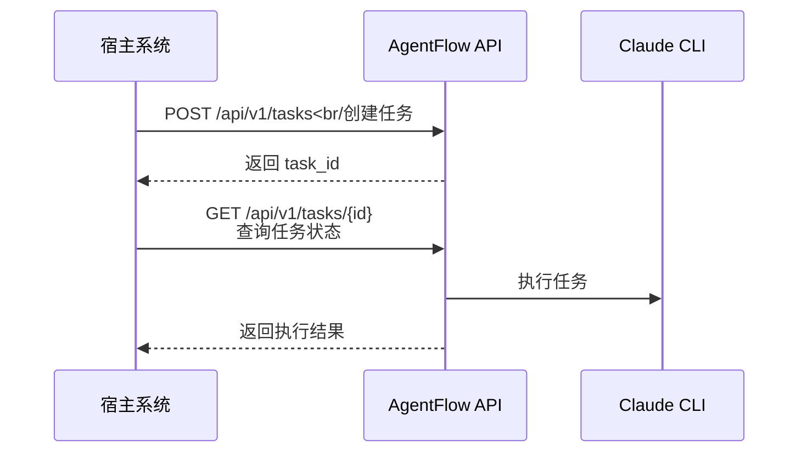

# AgentFlow 技能集成指南

**目标读者**: 希望将 AgentFlow 作为 skill/模块集成到自己系统中的开发者

**适用场景**:
- 将 AgentFlow 作为任务执行器嵌入到 AI Agent 系统
- 在 Rust 应用中直接使用 AgentFlow 的核心能力
- 通过 HTTP API 远程调用 AgentFlow 服务

---

## 📋 目录

1. [前置依赖](#前置依赖)
2. [集成模式](#集成模式)
   - [模式 A: HTTP API 集成](#模式-a-http-api-集成)
   - [模式 B: Rust 库嵌入](#模式-b-rust-库嵌入)
3. [API 端点列表](#api-端点列表)
4. [安全与资源控制](#安全与资源控制)
5. [实战示例](#实战示例)
6. [故障排查](#故障排查)

---

## 前置依赖

### 1. Claude CLI 安装

AgentFlow 依赖 Claude CLI 来执行任务。宿主系统需要预先安装 Claude CLI。

#### macOS/Linux

```bash
# 使用 npm 安装
npm install -g @anthropic-ai/claude-code

# 或使用 install script
curl -fsSL https://claude.ai/install.sh | sh
```

#### 验证安装

```bash
claude --version
# 输出: Claude Code v1.x.x
```

#### 配置 Claude CLI

```bash
# 设置 API Key
claude auth

# 验证配置
claude whoami
```

### 2. AgentFlow 服务

有两种方式使用 AgentFlow：

**方式 1: 独立服务（推荐）**
- 下载预编译二进制或从源码编译
- 作为独立服务运行
- 通过 HTTP API 调用

**方式 2: 嵌入式库**
- 在 Rust 项目中添加 `agentflow-core` 依赖
- 直接使用 TaskExecutor / MemoryCore 等组件

---

## 集成模式

### 模式 A: HTTP API 集成

**适用场景**: 宿主系统通过 REST API 与 AgentFlow 交互

#### 架构图

```
┌─────────────────┐
│  宿主系统          │
│  (Python/Node.js)  │
└────────┬─────────┘
         │ HTTP API
         ▼
┌─────────────────┐
│  AgentFlow       │
│  (localhost:6767)│
└─────────────────┘
         │
         ▼
    Claude CLI
```

#### 最小接入流程



#### 示例代码（Python）

```python
import requests
import time

AGENTFLOW_URL = "http://localhost:6767"

def create_task(title: str, description: str) -> str:
    """创建任务"""
    response = requests.post(
        f"{AGENTFLOW_URL}/api/v1/tasks",
        json={
            "title": title,
            "description": description,
            "priority": "Medium"
        }
    )
    response.raise_for_status()
    return response.json()["data"]["task_id"]

def get_task_status(task_id: str) -> dict:
    """查询任务状态"""
    response = requests.get(
        f"{AGENTFLOW_URL}/api/v1/tasks/{task_id}"
    )
    response.raise_for_status()
    return response.json()["data"]

def execute_task(title: str, description: str) -> dict:
    """完整执行流程"""
    # 1. 创建任务
    task_id = create_task(title, description)
    print(f"✓ 任务已创建: {task_id}")

    # 2. 等待执行完成
    while True:
        task = get_task_status(task_id)
        status = task["status"]

        if status == "completed":
            result = task.get("result", {})
            print(f"✓ 任务完成: {result}")
            return task
        elif status == "failed":
            error = task.get("error", "未知错误")
            print(f"✗ 任务失败: {error}")
            raise Exception(error)

        time.sleep(1)

# 使用示例
if __name__ == "__main__":
    result = execute_task(
        title="分析代码",
        description="请分析当前目录的 Rust 代码结构"
    )
    print(result)
```

#### 示例代码（Node.js）

```javascript
const axios = require('axios');

const AGENTFLOW_URL = 'http://localhost:6767';

async function createTask(title, description) {
  const response = await axios.post(`${AGENTFLOW_URL}/api/v1/tasks`, {
    title,
    description,
    priority: 'Medium'
  });
  return response.data.data.task_id;
}

async function getTaskStatus(taskId) {
  const response = await axios.get(`${AGENTFLOW_URL}/api/v1/tasks/${taskId}`);
  return response.data.data;
}

async function executeTask(title, description) {
  // 创建任务
  const taskId = await createTask(title, description);
  console.log(`✓ 任务已创建: ${taskId}`);

  // 轮询状态
  while (true) {
    const task = await getTaskStatus(taskId);
    const { status } = task;

    if (status === 'completed') {
      console.log('✓ 任务完成:', task.result);
      return task;
    } else if (status === 'failed') {
      console.error('✗ 任务失败:', task.error);
      throw new Error(task.error);
    }

    await new Promise(resolve => setTimeout(resolve, 1000));
  }
}

// 使用示例
(async () => {
  const result = await executeTask(
    '分析代码',
    '请分析当前目录的 Node.js 代码结构'
  );
  console.log(result);
})();
```

---

### 模式 B: Rust 库嵌入

**适用场景**: 在 Rust 应用中直接使用 AgentFlow 的核心能力

#### Cargo.toml 配置

```toml
[dependencies]
agentflow-core = { path = "../AgentFlow/rust/agentflow-core" }
tokio = { version = "1.35", features = ["full"] }
anyhow = "1.0"
```

#### 示例代码

```rust
use agentflow_core::{
    executor::TaskExecutor,
    memory::MemoryCore,
    types::Task,
};
use tokio::fs;

#[tokio::main]
async fn main() -> anyhow::Result<()> {
    // 初始化 MemoryCore
    let memory = MemoryCore::new(":memory:").await?;

    // 初始化 TaskExecutor
    let executor = TaskExecutor::new(memory);

    // 创建任务
    let task = Task {
        id: None,
        title: "分析代码".to_string(),
        description: Some("请分析当前目录的 Rust 代码".to_string()),
        priority: "Medium".to_string(),
        status: "pending".to_string(),
        created_at: chrono::Utc::now().to_rfc3339(),
        completed_at: None,
        result: None,
        error: None,
    };

    // 执行任务
    let result = executor.execute_task(task).await?;

    println!("执行结果: {}", result);

    Ok(())
}
```

#### 直接使用 Sandbox

```rust
use agentflow_core::sandbox::ClaudeSandbox;

#[tokio::main]
async fn main() -> anyhow::Result<()> {
    let sandbox = ClaudeSandbox::new()?;

    let prompt = "请分析当前目录的 Rust 代码";
    let output = sandbox.execute(prompt, None).await?;

    println!("Claude 输出:\n{}", output);

    Ok(())
}
```

---

## API 端点列表

### 任务管理

| 端点 | 方法 | 描述 |
|------|------|------|
| `/api/v1/tasks` | POST | 创建任务 |
| `/api/v1/tasks/{id}` | GET | 获取任务详情 |
| `/api/v1/tasks` | GET | 获取任务列表 |
| `/api/v1/tasks/{id}/priority` | PATCH | 更新任务优先级 |
| `/api/v1/tasks/{id}` | DELETE | 取消任务 |

### WebSocket 实时流

| 端点 | 描述 |
|------|------|
| `/ws/task` | 任务执行实时流 |
| `/api/v1/stream` | SSE 事件流 |

### 健康检查

| 端点 | 描述 |
|------|------|
| `/health` | 服务健康状态 |
| `/api/v1/stats` | 系统统计信息 |

详细 API 文档: [API 文档](docs/API_REFERENCE.md)

---

## 安全与资源控制

### 1. 认证

AgentFlow 支持双认证方式：

#### 用户 Session 认证（推荐用于前端）

```bash
# 1. 登录获取 Session
curl -X POST http://localhost:6767/api/v1/login \
  -H "Content-Type: application/json" \
  -d '{"username":"admin","password":"admin"}'

# 2. 使用 Session 访问 API
curl http://localhost:6767/api/v1/tasks \
  -H "Authorization: Bearer <session_id>"
```

#### API Key 认证（推荐用于服务间）

```bash
# 生成 API Key (使用共享密钥)
TIMESTAMP=$(date +%s)
SIGNATURE=$(echo -n "$TIMESTAMP" | openssl dgst -sha256 -hmac "your_secret" | awk '{print $2}')
API_KEY="sk_${TIMESTAMP}_${SIGNATURE}"

# 使用 API Key 访问
curl http://localhost:6767/api/v1/tasks \
  -H "Authorization: Bearer $API_KEY"
```

### 2. 资源限制

建议为 AgentFlow 设置以下资源限制：

```ini
# systemd service 示例
[Service]
# CPU 限制
CPUQuota=50%

# 内存限制（100MB）
MemoryMax=100M

# 文件描述符限制
LimitNOFILE=65536

# 超时时间
TimeoutStartSec=300
```

### 3. 网络隔离

建议使用反向代理（Nginx/Caddy）并配置：

```nginx
# Nginx 示例
location /api/v1/ {
    # 限流
    limit_req zone=agentflow burst=20 nodelay;

    # 超时
    proxy_read_timeout 300s;

    # 最大请求体
    client_max_body_size 10M;

    proxy_pass http://localhost:6767;
}
```

---

## 实战示例

### 示例 1: FastAPI 服务集成

**场景**: Python FastAPI 服务作为宿主，集成 AgentFlow 作为任务执行器

**完整示例**: `examples/skill-integration-demo/fastapi/`

**核心代码**:

```python
from fastapi import FastAPI, BackgroundTasks
import requests
import asyncio

app = FastAPI()
AGENTFLOW_URL = "http://localhost:6767"

@app.post("/execute")
async def execute_task(task: dict):
    """异步执行任务"""
    # 1. 创建 AgentFlow 任务
    response = requests.post(
        f"{AGENTFLOW_URL}/api/v1/tasks",
        json=task
    )
    task_id = response.json()["data"]["task_id"]

    # 2. 等待完成
    while True:
        task_status = requests.get(
            f"{AGENTFLOW_URL}/api/v1/tasks/{task_id}"
        ).json()["data"]

        if task_status["status"] == "completed":
            return {
                "task_id": task_id,
                "result": task_status["result"]
            }
        elif task_status["status"] == "failed":
            return {
                "task_id": task_id,
                "error": task_status["error"]
            }

        await asyncio.sleep(1)

if __name__ == "__main__":
    import uvicorn
    uvicorn.run(app, host="0.0.0.0", port=8000)
```

**运行示例**:

```bash
# 终端 1: 启动 AgentFlow
./rust/target/release/agentflow-master

# 终端 2: 启动 FastAPI 服务
cd examples/skill-integration-demo/fastapi
pip install -r requirements.txt
python main.py

# 终端 3: 测试
curl -X POST http://localhost:8000/execute \
  -H "Content-Type: application/json" \
  -d '{"title":"分析代码","description":"请分析当前目录"}'
```

---

## 故障排查

### 1. Claude CLI 未找到

**错误**: `Failed to execute task: Claude CLI not found`

**解决**:
```bash
# 安装 Claude CLI
npm install -g @anthropic-ai/claude-code

# 配置环境变量
export PATH="$PATH:$HOME/.local/bin"
```

### 2. 任务一直处于 pending 状态

**可能原因**:
- AgentFlow 服务未启动
- Claude CLI 未配置 API Key
- 网络问题

**排查步骤**:
```bash
# 1. 检查 AgentFlow 状态
curl http://localhost:6767/health

# 2. 检查 Claude CLI 配置
claude whoami

# 3. 查看 AgentFlow 日志
journalctl -u agentflow-master -f
```

### 3. API 认证失败

**错误**: `401 Unauthorized`

**解决**:
```bash
# 检查认证是否启用
curl http://localhost:6767/health | jq '.auth_enabled'

# 如果启用，需要提供认证
curl http://localhost:6767/api/v1/login \
  -H "Content-Type: application/json" \
  -d '{"username":"admin","password":"admin"}'
```

---

## 下一步

- [生产部署指南](DEPLOYMENT.md) - systemd/Docker/K8s 部署
- [集群部署指南](CLUSTERING.md) - 多节点集群方案
- [系统架构](ARCHITECTURE.md) - 深入理解架构设计

---

**文档版本**: 1.0.0
**最后更新**: 2026-01-28
