# AgentFlow Node.js 版本可行性分析报告

## 📊 当前代码统计

| 版本 | 代码行数 | 核心文件 | 主要功能 |
|------|---------|---------|---------|
| **Python** | ~1,767 行 | 5 个核心文件 | Master, Worker, Database, CLI, Git Integration |
| **Go** | ~3,556 行 | 8 个核心文件 | Master, Worker, Database, Executors, Config, Git Integration |

---

## 🎯 Node.js 版本定位建议

### 核心定位：**全栈 Web 应用和实时协作**

与现有版本的差异化定位：

| 维度 | Python 版本 | Go 版本 | **Node.js 版本 (建议)** |
|------|------------|---------|----------------------|
| **主要优势** | 跨平台 GUI、易开发 | 高性能、容器化 | **实时通信、前后端统一** |
| **最佳场景** | 本地开发、桌面自动化 | 云端部署、大规模并发 | **Web 应用、实时协作、Serverless** |
| **目标用户** | 个人开发者、数据科学家 | DevOps、后端工程师 | **全栈开发者、Web 团队** |
| **部署方式** | 本地/虚拟环境 | Docker/K8s | **Serverless/Edge/容器** |

---

## ✅ 优势分析

### 1. **技术生态优势**

#### 丰富的 NPM 生态
```javascript
// Agent 执行器可以轻松集成各种 NPM 包
- @anthropic-ai/sdk (官方 SDK)
- puppeteer/playwright (浏览器自动化)
- node-pty (终端模拟)
- ws (WebSocket 实时通信)
- socket.io (实时协作)
- bull (任务队列，替代 Redis)
- ioredis (Redis 客户端)
- axios (HTTP 客户端)
```

#### 前后端技术栈统一
```javascript
// 同一份 TypeScript 代码可以运行在前后端
// 前端：React/Vue + AgentFlow SDK
// 后端：Node.js + AgentFlow Server

// 类型共享
types/
├── task.ts          # 任务类型定义
├── worker.ts        # Worker 类型定义
├── events.ts        # 事件类型定义
└── api.ts           # API 接口类型
```

### 2. **实时通信优势**

#### WebSocket 原生支持
```typescript
// 实时任务进度推送
import { WebSocketServer } from 'ws';

const wss = new WebSocketServer({ port: 8849 });

wss.on('connection', (ws) => {
  // 实时推送任务进度
  db.on('task_progress', (task) => {
    ws.send(JSON.stringify({
      type: 'progress',
      data: task
    }));
  });

  // 实时推送 Worker 状态
  db.on('worker_status', (worker) => {
    ws.send(JSON.stringify({
      type: 'worker_status',
      data: worker
    }));
  });
});
```

#### Server-Sent Events (SSE)
```typescript
// 单向实时推送
import express from 'express';
import { createEventStream } from 'sse';

app.get('/api/events', (req, res) => {
  const stream = createEventStream(res);

  // 推送任务创建事件
  taskEmitter.on('created', (task) => {
    stream.write({ event: 'task.created', data: task });
  });

  // 推送任务完成事件
  taskEmitter.on('completed', (task) => {
    stream.write({ event: 'task.completed', data: task });
  });
});
```

### 3. **异步 I/O 性能优势**

#### 事件驱动架构
```typescript
// 适合大量 I/O 密集型操作
import { EventEmitter } from 'events';

class TaskExecutor extends EventEmitter {
  async executeTask(task: Task) {
    this.emit('start', task);

    try {
      // 并发执行多个子任务
      const results = await Promise.allSettled([
        this.runClaude(task),
        this.uploadArtifacts(task),
        this.notifyWebhooks(task)
      ]);

      this.emit('complete', { task, results });
    } catch (error) {
      this.emit('error', { task, error });
    }
  }
}
```

### 4. **Serverless 友好**

#### AWS Lambda 示例
```typescript
// master.ts - API Gateway + Lambda
import { APIGatewayProxyHandler } from 'aws-lambda';

export const createTask: APIGatewayProxyHandler = async (event) => {
  const task = JSON.parse(event.body);

  // 存储到 DynamoDB
  await dynamoDb.put({
    TableName: 'tasks',
    Item: task
  }).promise();

  // 触发 Lambda Workers
  await lambda.invoke({
    FunctionName: 'agentflow-worker',
    InvocationType: 'Event', // 异步调用
    Payload: JSON.stringify(task)
  }).promise();

  return {
    statusCode: 201,
    body: JSON.stringify({ task_id: task.id })
  };
};

// worker.ts - Lambda Worker
export const handler = async (event) => {
  const { task_id, description } = event;

  // 执行任务
  const result = await executeWithClaude(description);

  // 更新状态
  await dynamoDb.update({
    TableName: 'tasks',
    Key: { id: task_id },
    UpdateExpression: 'SET #status = :status, result = :result',
    ExpressionAttributeNames: { '#status': 'status' },
    ExpressionAttributeValues: {
      ':status': 'completed',
      ':result': result
    }
  }).promise();

  return result;
};
```

### 5. **开发体验优势**

#### TypeScript 类型安全
```typescript
// 完整的类型定义
interface Task {
  id: string;
  title: string;
  description: string;
  status: 'pending' | 'running' | 'completed' | 'failed';
  priority: 'low' | 'medium' | 'high';
  group_name: string;
  created_at: Date;
  started_at?: Date;
  completed_at?: Date;
  result?: string;
  error?: string;
}

interface Worker {
  id: string;
  name: string;
  platform: 'darwin' | 'linux' | 'windows';
  status: 'online' | 'offline';
  capabilities: string[];
  last_heartbeat: Date;
}

// 类型安全的 API
class Master {
  async createTask(task: Omit<Task, 'id' | 'created_at'>): Promise<Task> {
    // 编译时类型检查
  }

  async getPendingTasks(limit: number): Promise<Task[]> {
    // IDE 自动补全
  }
}
```

---

## ❌ 劣势与挑战

### 1. **单线程限制**

**问题**: CPU 密集型任务会阻塞事件循环

**解决方案**:
```typescript
// 方案 1: Worker Threads
import { Worker } from 'worker_threads';

function executeInWorker(task: Task): Promise<string> {
  return new Promise((resolve, reject) => {
    const worker = new Worker('./task-executor.js', {
      workerData: task
    });

    worker.on('message', resolve);
    worker.on('error', reject);
  });
}

// 方案 2: Child Processes
import { spawn } from 'child_process';

function executeInProcess(task: Task): Promise<string> {
  return new Promise((resolve, reject) => {
    const child = spawn('node', ['task-executor.js', JSON.stringify(task)]);

    let output = '';
    child.stdout.on('data', (data) => {
      output += data.toString();
    });

    child.on('close', (code) => {
      if (code === 0) resolve(output);
      else reject(new Error(`Process exited with code ${code}`));
    });
  });
}

// 方案 3: 使用 Go/Python Worker 混合部署
// Node.js Master 调度 Go/Python Workers 执行 CPU 密集型任务
```

### 2. **内存管理**

**问题**: 大任务可能导致内存泄漏

**解决方案**:
```typescript
// 使用流处理大文件
import { createReadStream, createWriteStream } from 'fs';

async function processLargeFile(inputPath: string, outputPath: string) {
  const readStream = createReadStream(inputPath);
  const writeStream = createWriteStream(outputPath);

  return new Promise((resolve, reject) => {
    readStream
      .pipe(transformStream)
      .pipe(writeStream)
      .on('finish', resolve)
      .on('error', reject);
  });
}

// 定期内存检查
setInterval(() => {
  const usage = process.memoryUsage();
  if (usage.heapUsed > 1024 * 1024 * 1024) { // 1GB
    console.warn('High memory usage:', usage);
    // 触发清理或重启
  }
}, 30000);
```

### 3. **依赖管理复杂**

**问题**: node_modules 体积大，依赖冲突

**解决方案**:
```json
// 使用 pnpm 工作区
{
  "name": "agentflow-monorepo",
  "private": true,
  "scripts": {
    "dev": "turbo run dev",
    "build": "turbo run build",
    "test": "turbo run test"
  }
}

// packages/
// ├── master/          # Master 服务
// ├── worker/          # Worker 实现
// ├── cli/             # 命令行工具
// ├── sdk/             # TypeScript SDK
// └── shared/          # 共享代码
```

---

## 🏗️ 架构设计

### 技术栈推荐

```yaml
核心框架:
  - Express.js (HTTP API)
  - Fastify (高性能替代)
  - ws (WebSocket)

数据库:
  - SQLite3 (本地开发)
  - PostgreSQL (生产环境)
  - better-sqlite3 (同步 SQLite)

任务队列:
  - Bull (Redis 队列)
  - BullMQ (Bull 现代化版本)
  - Bull Board (任务监控面板)

类型系统:
  - TypeScript 5.x
  - Zod (运行时验证)

CLI:
  - Commander.js
  - Chalk (终端颜色)
  - Ora (加载动画)

Claude 集成:
  - @anthropic-ai/sdk
  - node-pty (终端模拟)

Git 集成:
  - simple-git (Git 操作)
  - isomorphic-git (纯 JS Git)

部署:
  - Docker
  - Serverless Framework
  - AWS Lambda
  - Vercel/Netlify (Edge Functions)
```

### 项目结构

```
nodejs/
├── packages/
│   ├── master/                 # Master 服务
│   │   ├── src/
│   │   │   ├── server.ts       # Express 服务器
│   │   │   ├── routes/
│   │   │   │   ├── tasks.ts    # 任务路由
│   │   │   │   ├── workers.ts  # Worker 路由
│   │   │   │   └── events.ts   # 实时事件路由
│   │   │   ├── websocket/
│   │   │   │   └── handler.ts  # WebSocket 处理
│   │   │   └── database/
│   │   │       └── client.ts   # 数据库客户端
│   │   └── package.json
│   │
│   ├── worker/                 # Worker 实现
│   │   ├── src/
│   │   │   ├── worker.ts       # Worker 主类
│   │   │   ├── executor/
│   │   │   │   ├── claude.ts   # Claude 执行器
│   │   │   │   ├── shell.ts    # Shell 执行器
│   │   │   │   └── http.ts     # HTTP 执行器
│   │   │   └── queue/
│   │   │       └── consumer.ts # 任务队列消费者
│   │   └── package.json
│   │
│   ├── cli/                    # 命令行工具
│   │   ├── src/
│   │   │   ├── commands/
│   │   │   │   ├── master.ts
│   │   │   │   ├── worker.ts
│   │   │   │   └── oneshot.ts
│   │   │   └── index.ts
│   │   └── package.json
│   │
│   ├── sdk/                    # TypeScript SDK
│   │   ├── src/
│   │   │   ├── client.ts       # HTTP 客户端
│   │   │   ├── types.ts        # 类型定义
│   │   │   └── websocket.ts    # WebSocket 客户端
│   │   └── package.json
│   │
│   └── shared/                 # 共享代码
│       ├── src/
│       │   ├── types/          # 类型定义
│       │   ├── utils/          # 工具函数
│       │   └── config/         # 配置
│       └── package.json
│
├── apps/
│   ├── web-dashboard/          # Web 管理界面
│   │   ├── src/
│   │   │   ├── components/     # React/Vue 组件
│   │   │   ├── pages/          # 页面
│   │   │   └── main.tsx
│   │   └── package.json
│   │
│   └── vscode-extension/       # VSCode 插件
│       ├── src/
│       │   ├── extension.ts
│       │   └── client.ts
│       └── package.json
│
├── docker/
│   ├── Dockerfile.master
│   ├── Dockerfile.worker
│   └── docker-compose.yml
│
├── scripts/
│   ├── build.sh
│   └── deploy.sh
│
├── package.json
├── pnpm-workspace.yaml
├── tsconfig.json
└── turbo.json
```

---

## 📊 性能对比预估

| 指标 | Python | Go | **Node.js (预估)** |
|------|--------|-----|------------------|
| **HTTP 吞吐量** | ~1,000 req/s | ~10,000 req/s | **~5,000 req/s** |
| **内存使用** | ~50MB/进程 | ~20MB/进程 | **~35MB/进程** |
| **启动时间** | ~1s | <100ms | **~300ms** |
| **并发连接** | 1,000 | 10,000+ | **10,000+** |
| **CPU 密集型** | 中等 | 优秀 | 较弱 ⚠️ |
| **I/O 密集型** | 中等 | 优秀 | **优秀** ✅ |
| **WebSocket 支持** | 需额外库 | 需额外库 | **原生支持** ✅ |

---

## ⏱️ 工作量估算

### 阶段 1: 核心功能（2-3 周）

| 任务 | 工作量 | 说明 |
|------|--------|------|
| **Master 服务** | 5-7 天 | Express API + WebSocket |
| **Worker 实现** | 5-7 天 | 任务执行器 + 队列 |
| **Database 层** | 3-4 天 | SQLite/PostgreSQL 适配 |
| **CLI 工具** | 2-3 天 | Commander.js + Chalk |
| **测试** | 3-5 天 | 单元测试 + 集成测试 |

**小计**: **18-26 天**（约 3-4 周）

### 阶段 2: 高级功能（2-3 周）

| 任务 | 工作量 | 说明 |
|------|--------|------|
| **Git 集成** | 4-5 天 | simple-git + 文件边界 |
| **Claude 集成** | 3-4 天 | @anthropic-ai/sdk |
| **任务队列** | 3-4 天 | Bull/BullMQ |
| **WebSocket 实时通信** | 3-4 天 | 实时进度推送 |
| **配置系统** | 2-3 天 | YAML + 环境变量 |
| **测试** | 3-5 天 | 端到端测试 |

**小计**: **18-25 天**（约 3 周）

### 阶段 3: Web Dashboard（2-3 周）

| 任务 | 工作量 | 说明 |
|------|--------|------|
| **前端框架搭建** | 2-3 天 | React/Vite + TailwindCSS |
| **任务管理页面** | 4-5 天 | 任务列表、详情、创建 |
| **实时更新** | 3-4 天 | WebSocket 客户端 |
| **Worker 监控** | 3-4 天 | Worker 状态、日志 |
| **Git 集成界面** | 3-4 天 | 文件边界、分支可视化 |
| **测试** | 2-3 天 | E2E 测试 |

**小计**: **17-23 天**（约 2-3 周）

### 阶段 4: 部署和文档（1-2 周）

| 任务 | 工作量 | 说明 |
|------|--------|------|
| **Docker 镜像** | 2-3 天 | Master/Worker 镜像 |
| **Serverless 部署** | 3-4 天 | AWS Lambda 配置 |
| **文档编写** | 3-4 天 | API 文档、使用指南 |
| **示例代码** | 2-3 天 | 使用示例 |

**小计**: **10-14 天**（约 1.5-2 周）

---

### **总计工作量**: **63-88 天**（约 **2.5-3.5 个月**）

以 1 人全职开发计算：**3-4 个月**

以 2 人团队开发计算：**1.5-2 个月**

---

## 🎯 适用场景

### ✅ **强烈推荐使用 Node.js 版本的场景**

1. **Web 应用后端**
   - 需要实时任务进度推送
   - 前后端技术栈统一
   - WebSocket/EventSource 需求

2. **Serverless 架构**
   - AWS Lambda / Google Cloud Functions
   - 按需付费，降低成本
   - 短期任务、突发流量

3. **实时协作系统**
   - 多人协作开发平台
   - 实时代码审查
   - 在线 IDE 集成

4. **前后端统一项目**
   - 全栈 JavaScript/TypeScript 团队
   - 共享类型定义
   - 减少 API 对接成本

5. **微服务架构**
   - 快速迭代
   - 容器化部署
   - 服务间通信

### ❌ **不推荐使用 Node.js 版本的场景**

1. **CPU 密集型任务**
   - 大规模数据处理
   - 图像/视频处理
   - 机器学习模型训练
   - → **推荐 Go 版本**

2. **系统级自动化**
   - GUI 自动化
   - 系统调用
   - 跨平台桌面操作
   - → **推荐 Python 版本**

3. **长期运行服务**
   - 对内存占用敏感
   - 需要极低延迟
   - → **推荐 Go 版本**

---

## 🔄 与现有版本的协作

### 混合部署架构

```typescript
// Node.js Master 调度 Python/Go Workers
interface MasterConfig {
  workers: {
    python: {
      count: 2;
      capabilities: ['gui', 'cross-platform'];
    };
    go: {
      count: 10;
      capabilities: ['high-performance', 'cloud'];
    };
    nodejs: {
      count: 5;
      capabilities: ['webhook', 'realtime'];
    };
  };
}

// 根据任务类型自动路由
class TaskRouter {
  route(task: Task): WorkerType {
    if (task.requires_gui) return 'python';
    if (task.is_cpu_intensive) return 'go';
    if (task.requires_webhook) return 'nodejs';
    return 'go'; // 默认
  }
}
```

### API 兼容性

```typescript
// 三个版本 API 100% 兼容
interface AgentFlowAPI {
  // Task endpoints
  createTask(task: Partial<Task>): Promise<Task>;
  getTask(id: string): Promise<Task>;
  listTasks(filter?: TaskFilter): Promise<Task[]>;

  // Worker endpoints
  listWorkers(): Promise<Worker[]>;
  updateWorkerHeartbeat(id: string): Promise<void>;

  // Execution
  executeTask(taskId: string): Promise<ExecutionResult>;
}
```

---

## 💡 建议的实施策略

### 方案 1: **渐进式实施**（推荐）

```mermaid
graph LR
    A[阶段 1<br/>核心 Master/Worker] --> B[阶段 2<br/>实时通信]
    B --> C[阶段 3<br/>Web Dashboard]
    C --> D[阶段 4<br/>Serverless 支持]
```



**优势**:
- 风险可控
- 快速验证可行性
- 逐步完善功能

**时间规划**:
- Month 1: 阶段 1-2
- Month 2: 阶段 3
- Month 3: 阶段 4 + 测试

### 方案 2: **MVP 优先**

**先实现最小可行产品**:
1. 基础 Master API
2. 简单 Worker 执行器
3. SQLite 数据库
4. 基本文档

**时间规划**: **4-6 周**

### 方案 3: **分阶段开源**

- Week 1-4: 核心功能（内部测试）
- Week 5-6: Beta 版（小范围测试）
- Week 7-8: 正式发布 v1.0.0
- Week 9+: 社区反馈 + 迭代

---

## 📋 结论与建议

### ✅ **值得实施 Node.js 版本的理由**

1. **填补实时协作场景空白**
   - WebSocket 原生支持
   - 前后端技术栈统一
   - 丰富的 Web 生态

2. **Serverless 友好**
   - AWS Lambda 零成本启动
   - 自动扩缩容
   - 按需付费

3. **降低全栈团队成本**
   - TypeScript 全栈
   - 共享类型定义
   - 减少 API 对接成本

4. **差异化竞争优势**
   - Web Dashboard 开箱即用
   - 实时进度推送
   - VSCode 插件集成

### ⚠️ **需要权衡的问题**

1. **开发成本**: 2.5-3.5 个月（1 人全职）
2. **维护成本**: 需要维护 3 个版本
3. **性能限制**: CPU 密集型任务不如 Go
4. **定位冲突**: 需要与 Python/Go 版本明确区分

### 🎯 **最终建议**

#### **建议实施，但要明确差异化定位**：

**Node.js 版本 = Web 实时协作 + Serverless**

- ✅ 专注于 Web 应用场景
- ✅ 提供实时通信能力
- ✅ 前后端技术栈统一
- ❌ 不追求极致性能（Go 版本）
- ❌ 不做 GUI 自动化（Python 版本）

#### **优先级排序**：

1. **Phase 1** (MVP - 6 周): 核心功能
   - Master API + WebSocket
   - 基础 Worker
   - SQLite 数据库
   - 简单 Web Dashboard

2. **Phase 2** (完善 - 6 周): 生产就绪
   - 任务队列 (BullMQ)
   - Git 集成
   - 完整 Web Dashboard
   - Docker 部署

3. **Phase 3** (扩展 - 4 周): 高级特性
   - Serverless 部署
   - VSCode 插件
   - 完整文档和示例

---

## 🚀 快速启动决策

### 如果满足以下 **3 个以上条件**，建议实施：

- ✅ 团队有 TypeScript/JavaScript 经验
- ✅ 需要实时通信（WebSocket）
- ✅ 计划提供 Web Dashboard
- ✅ 考虑 Serverless 部署
- ✅ 有 2-3 个月开发周期

### 如果满足以下 **2 个以上条件**，不建议实施：

- ❌ 追求极致性能（Go 版本）
- ❌ 需要 GUI 自动化（Python 版本）
- ❌ CPU 密集型任务为主
- ❌ 团队不熟悉 JavaScript 生态
- ❌ 资源有限（< 2 个月开发时间）

---

**版本**: v1.0.0
**创建日期**: 2026-01-22
**作者**: AgentFlow Team
