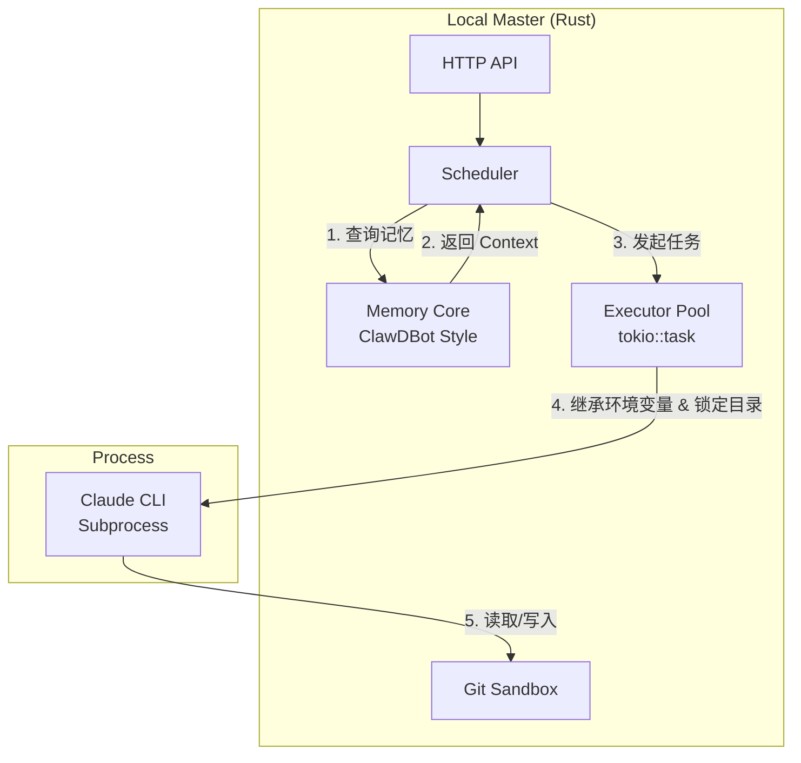

这确实是更进一步的极简方案。去掉了 Node.js 这个中间层，**Rust 直接掌管进程和文件系统**，性能更好，资源更省，排查问题也更直接。
这本质上回归了 **"One Binary, One Process Tree"** 的 Unix 哲学。
以下是调整后的 **AgentFlow v3 (纯 Rust 执行版)** 完整开发计划。
---
# 项目开发计划书：AgentFlow v3 (Pure Rust Execution)
## 1. 架构极简重构
**核心理念**：Master 即 Worker。不再有独立的 Worker 进程，所有任务执行由 Master 内部的 `tokio` 异步任务池直接驱动。
**组件变化**：
- **移除**：Node.js Worker, `worker/` 目录, WebSocket 进程间通信。
- **新增**：`rust-core/src/executor.rs` (直接调用 Claude CLI 的执行器)。
- **保留**：Cloud Master (路由), Memory Core (SQLite), Git Sandbox (文件安全)。

---
## 2. 第一阶段：核心执行器 (替代 Node.js Worker)
这是新方案的核心，负责直接与 `claude` 命令行工具交互。
### Task 1.1: 实现同步/异步执行接口
**文件**: `rust-core/src/executor/mod.rs`
**需求细节**:
1.  **定义结构体**:
    ```rust
    pub struct TaskExecutor {
        workspace_path: PathBuf, // Git 沙箱路径
    }
    ```
2.  **执行方法 `run`**:
    - 使用 `tokio::process::Command`.
    - **环境变量**：
        - 继承父进程的环境变量 (`inherit_env()`). **关键**：这样 Master 无需知道 API Key，`claude` 进程会自动读取用户本地的 `ANTHROPIC_API_KEY`。
    - **工作目录**：
        - `current_dir(workspace_path)`. **强制**：确保所有操作发生在 Git 仓库内。
    - **命令**：
        - 执行 `claude` 命令，通过 Stdin 注入 Prompt。
3.  **流式处理**:
    - 实时捕获 `Stdout` 和 `Stderr`。
    - 通过 WebSocket 或 Server-Sent Events (SSE) 推送给 Web 前端。
### Task 1.2: Prompt 构建与记忆注入
**文件**: `rust-core/src/executor/prompt_builder.rs`
**需求细节**:
1.  在调用 `claude` 前，构建完整 Prompt：
    ```text
    [System Instruction: You are an expert coder...]
    
    [Memory Context - Retreived from SQLite]
    - [Memo] Fix DX12 crash: ensure reset command list...
    
    [User Task]
    Please refactor the render loop...
    ```
2.  处理 Prompt 长度限制：
    - 如果 Prompt 超过 Claude 上下文限制，自动截断 Memory Context，保留最近/最相关的部分。
---
## 3. 第二阶段：沙箱安全强化 (Rust 级别控制)
既然 Rust 直接拉起进程，安全控制必须在 Rust 层面做死。
### Task 2.1: 路径穿透防御
**文件**: `rust-core/src/sandbox/mod.rs`
**需求细节**:
1.  **目录白名单**：
    - Master 初始化时加载配置，只允许访问特定目录（如 `~/repos/`）。
2.  **预检机制**：
    - 在 Executor 启动前，检查 `workspace_path` 是否在白名单内。
    - 如果不在白名单，直接拒绝 Task，返回 `SecurityError`。
### Task 2.2: 进程生命周期管理
**文件**: `rust-core/src/executor/killer.rs`
**需求细节**:
1.  **超时熔断**：
    - 设置 Task 超时时间（如 30 分钟）。
    - 超时后，发送 `SIGTERM`。
    - 优雅等待 5 秒后，若进程未退出，发送 `SIGKILL`。
2.  **级联清理**：
    - 确保 `claude` 可能拉起的子进程（如编译器）也被一并清理（使用 Process Group）。
---
## 4. 第三阶段：记忆与执行深度融合 (ClawDBot 风格)
### Task 3.1: 自动记忆回写
**文件**: `rust-core/src/executor/hooks.rs`
**需求细节**:
1.  **后置 Hook**：
    - Task 执行完毕后，解析 `stdout`。
    - 如果 Claude 输出包含特定的标记（例如 `<save_memory>...</save_memory>`），提取内容。
2.  **写入 Markdown**：
    - 追加写入 `memory/{date}.md`。
    - 触发 Memory Core 的 `Indexer`，立即更新 SQLite 向量索引。
---
## 5. 第四阶段：工程化与打包
### Task 4.1: 移除 Node.js 依赖
**操作**:
- 删除仓库中的 `worker/` 目录。
- 删除 `package.json`.
- 更新 README：不再需要 `npm install`。
### Task 4.2: 纯 Rust 打包
**操作**:
- 保留 GitHub Actions 的交叉编译配置。
- 确保 `target/release/agentflow` 是唯一的交付物。
- 在 Linux/Mac/Windows 上，用户只需下载这一个文件即可。
---
## 6. 并行开发任务分配 (更新版)
### Team A: 执行引擎
- 实现 `TaskExecutor` (Task 1.1).
- 实现流式输出处理。
- 实现进程超时与杀戮逻辑 (Task 2.2).
### Team B: 记忆与安全
- 实现 `MemoryCore` 的索引与检索 (沿用之前计划).
- 实现 `Sandbox` 路径检查 (Task 2.1).
- 实现 `PromptBuilder` (Task 1.2).
### Team C: 部署与 API
- 实现 HTTP/WebSocket API (暴露 Executor 输出).
- 编写一键安装脚本 (自动下载 `agentflow` 二进制).
- 实现 Cloud Master 的路由逻辑.
---
## 7. 验收标准
1.  **资源消耗**：
    - 运行 10 个并发 Task，内存占用应显著低于 Node.js 版本（预计 < 100MB 空闲）。
2.  **安全测试**：
    - Task 尝试执行 `cd / && rm -rf test`。
    - Rust Executor 应拒绝执行或通过沙箱隔离，确保系统根目录不受影响。
3.  **记忆测试**：
    - 执行 Task 产生错误日志。
    - 系统自动将其写入 `MEMORY.md`。
    - 下一个相关 Task 能检索到该错误。
---
**指令提示**:
Agent 请注意，现在**不需要**涉及任何 Node.js 代码。
请专注于 Rust 的 `tokio::process` 使用，以及如何安全地将 `stdout` 流转发给 WebSocket 客户端。
保持单二进制设计的简洁性。
**开始执行！**
