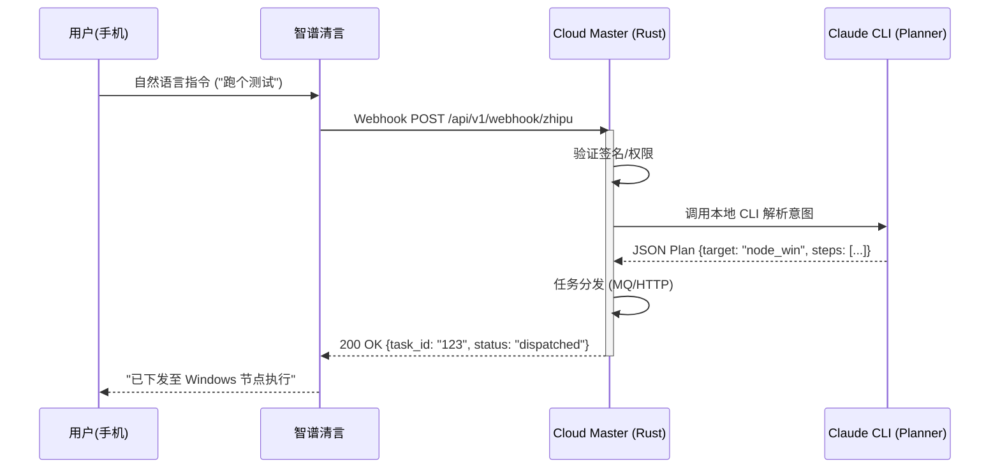

```markdown
# AgentFlow 扩展开发计划：智谱清言接入与大屏监控
## 1. 概述
**背景**：AgentFlow 目前已完成 Rust Core + Claude CLI Worker 的基础架构，具备本地任务执行和初步的云端分发能力。
**目标**：补全交互闭环，实现“随时接入”与“可视运行”。
- **输入端**：接入智谱清言智能体，作为手机/语音指令网关。
- **输出端**：构建大屏监控，实时展示节点状态与 CLI 执行日志。
**核心约束**：
- 所有代码执行**必须**通过本地 `claude cli` 完成，Rust 仅负责调度与上下文管理。
- 智谱清言仅作为指令传输通道，不参与具体的代码生成与执行。
---
## 2. 模块一：智谱清言智能体接入
### 2.1 架构设计

### 2.2 功能细节
#### A. Webhook 接口 (`rust/agentflow-master/src/webhook/zhipu.rs`)
- **路径**: `/api/v1/webhook/zhipu`
- **方法**: `POST`
- **鉴权**:
  - 在配置文件中设置 `[webhook] secret = "..."`。
  - 检查请求 Header 中的 `Authorization: Bearer <secret>` 或自定义签名。
  - (建议) 配置 IP 白名单，仅允许智谱服务器 IP 访问。
- **协议 Body**:
  ```json
  {
    "text": "用户原始的指令文本",
    "session_id": "智谱会话ID（可选）"
  }
  ```
#### B. 意图解析流程
1.  **接收指令**: Cloud Master 接收 Webhook 请求。
2.  **标准化**: 调用本地的 `PromptBuilder`，构建针对 Planner 的 Prompt。
    - *注*：Prompt 中需注入系统状态（当前有哪些节点在线、当前 Git 分支等）。
3.  **CLI 调用**: 执行 `claude -p "..."`。
    - 要求 CLI 返回结构化 JSON（利用 Function Calling 或 Prompt 强制）：
      ```json
      {
        "target_node": "home_win",
        "repo": "DiveAdstra",
        "risk_level": "low",
        "steps": ["git pull", "cargo test"]
      }
      ```
4.  **任务分发**: Master 将 JSON 转换为内部 Task，推送给目标 Node。
#### C. 响应策略
- **同步响应**: 立即返回 `task_id`，告知智谱“任务已接收”。
- **异步状态**: 智谱通过另一个接口（或轮询）查询任务结果。
  - *MVP*: 仅做触发，结果由用户自行通过大屏或 CLI 查看。
---
## 3. 模块二：大屏驾驶舱
### 3.1 核心功能模块
大屏旨在将 AgentFlow 的“黑盒”运行状态透明化。
#### A. 节点拓扑图
- **展示内容**:
  - Cloud Master (中心节点)。
  - Edge Nodes (周边节点：Win, Linux, Mac)。
  - 连线状态：实线 (在线)、虚线 (离线)。
- **交互**:
  - 悬停显示：OS 版本、CPU 负载、当前活跃 Task。
  - 点击查看：该节点的历史任务列表。
#### B. 实时任务流
- **展示内容**:
  - 正在运行的任务卡片。
  - **实时流式日志**: 直接展示 `claude cli` 的 Stdout 输出。
    - 区分颜色：用户输入 (白)、AI 思考 (灰)、Bash 命令 (黄)、文件修改 (绿)。
- **技术**: 使用 WebSocket 或 SSE 将日志流从 Rust 后端推送到前端。
#### C. 智能记忆库
- **展示内容**:
  - 最近挖掘的 `conversation_insights`。
  - 知识点增长趋势图 (每日新增 Insights 数量)。
#### D. 资源监控
- **数据源**: Rust 内部采集。
- **指标**:
  - 内存占用 (RSS)。
  - 活跃连接数。
  - Token 消耗估算 (基于 CLI 输入输出长度)。
### 3.2 技术栈选型
考虑到开发效率与 Rust 技术栈的亲和性，推荐以下两种方案：
#### 方案 A：Tauri (推荐用于桌面端)
- **架构**: Rust 后端 + Web 前端。
- **优势**:
  - 可以直接复用 AgentFlow 的 Rust 代码库（无需 HTTP 调用，直接内存调用）。
  - 性能极佳，打包体积小。
  - 适合作为常驻开发机的“主控台”。
- **实现**:
  - `src-tauri`: 集成 `agentflow-core`。
  - Frontend: 使用 React/Vue + Svelte，或者简单的原生 JS。
#### 方案 B：纯 Web (Vite + React)
- **架构**: 独立的前端项目 + AgentFlow REST API。
- **优势**:
  - 跨平台，手机也能看。
  - 部署灵活。
- **实现**:
  - 通过 `/api/v1/stream` (WebSocket) 连接后端。
  - 通过 HTTP 获取节点状态。
**建议**:
- 第一阶段 (MVP): 使用 **Tauri** 快速构建一个能看日志、看节点的桌面窗口。
- 第二阶段: 抽离前端逻辑，改为 **React Web App**，支持远程访问。
---
## 4. 协同场景示例
通过智谱清言和大屏的配合，实现“远程指挥，本地执行”。
1.  **场景**: 你在通勤路上（手机）。
    - **操作**: 打开智谱清言，输入："DiveAdstra 编译一下，如果成功就跑个 DX12 测试。"
    - **链路**: 智谱 -> Cloud Master (Webhook) -> 本机 Planner -> 识别为 Build+Test 任务 -> 分发给 Home PC。
    - **反馈**: 智谱回复："指令已下发，正在执行。"
2.  **场景**: 你回到家（电脑前）。
    - **观察**: 打开 AgentFlow 大屏。
    - **视觉**:
      - 拓扑图上 `home_win` 节点显示“忙碌（黄色）”。
      - 实时日志窗口滚动显示：
        ```
        [Bash] msbuild DiveAdstra.sln ...
        [Build] Success!
        [Bash] ./Binaries/DX12Benchmark.exe ...
        ```
    - **结果**: 任务结束，节点变绿，日志显示 "FPS: 120"。
---
## 5. 实施路线图
### Phase 1: Webhook 接入 (MVP)
**目标**: 能通过智谱清言触发本地简单任务。
- [ ] Cloud Master 新增 Webhook Server (Axum)。
- [ ] 实现签名校验中间件。
- [ ] 接通 Webhook -> CLI Planner -> 任务分发流程。
- [ ] 智谱清言配置测试。
### Phase 2: 基础大屏 (Tauri)
**目标**: 能在电脑上看到节点状态和静态日志。
- [ ] 搭建 Tauri 项目框架。
- [ ] 实现 `/api/v1/nodes` 接口。
- [ ] 前端绘制节点拓扑图（使用 React Flow 或 D3）。
- [ ] 实现任务列表查看。
### Phase 3: 实时流传输
**目标**: 大屏能实时滚动显示 CLI 执行过程。
- [ ] Rust 侧实现 WebSocket 广播。
- [ ] `TaskExecutor` 将 CLI Stdout 逐行推送到 Channel。
- [ ] 前端实现日志流组件。
### Phase 4: 记忆可视化与优化
**目标**: 数据层可视化。
- [ ] 接入 SQLite 的 `conversation_insights` 数据。
- [ ] 展示知识点检索界面。
- [ ] 前端 UI 美化与交互优化。
---
## 6. 关键风险与应对
| 风险             | 描述                           | 应对                                              |
| :--------------- | :----------------------------- | :------------------------------------------------ |
| **Webhook 安全** | 暴露在公网可能被刷接口         | 1. 强 Token 校验；2. IP 白名单；3. 请求频率限制。 |
| **状态同步延迟** | 智谱下发后，大屏更新可能有延迟 | 使用 WebSocket 推送代替轮询，确保实时性。         |
| **大屏性能**     | 日志刷屏导致前端卡顿           | 前端实现虚拟滚动；后端限制日志推送频率。          |
| **CLI 崩溃**     | Claude CLI 进程意外退出        | Rust 监控进程退出码，自动重试或记录失败状态。     |
```
